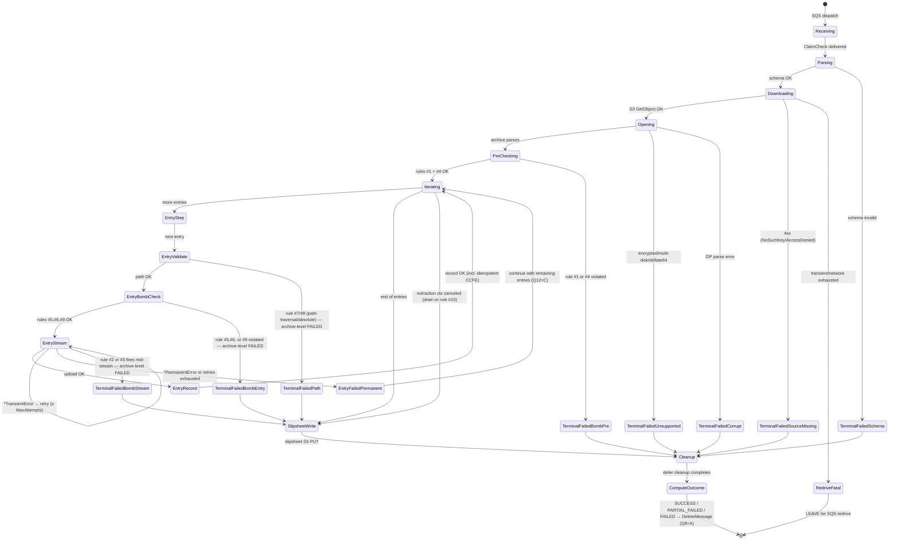
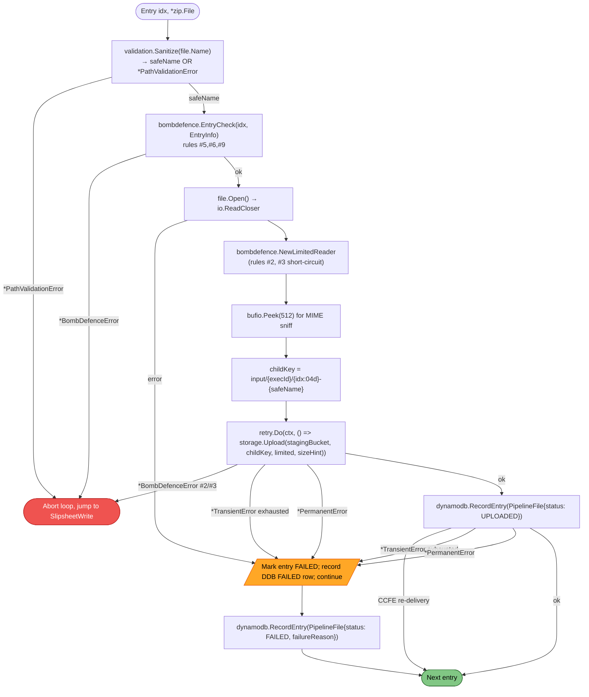

# Business Logic Model — zip-extraction (UOW-SVC-12)

**Document Type**: Business Logic & State Machine Model
**Phase**: CONSTRUCTION — Functional Design (Part 2: Generation)
**Generated**: 2026-05-24
**Unit**: `zip-extraction` (UOW-SVC-12)

This document captures the **technology-agnostic** business logic for processing a single SQS message through the Zip Extraction Service. It is the authoritative reference for every algorithmic decision and is the input to Code Generation. Concrete error types, AWS error mappings, and value-domain definitions live in `business-rules.md` and `domain-entities.md`.

---

## 1. Top-Level State Machine — `extraction.Service.Process`



**Notes on the state diagram**:

- **`SlipsheetWrite` is reached via every path that touched the per-entry loop** — including all bomb-defence-mid-extraction terminal failures. This ensures the slipsheet records what was uploaded before the failure (Q3 + Q1: orphaned children are documented, not cleaned up).
- **`Cleanup` is also reached on early terminal failures** (schema, source-missing, bomb-pre, unsupported, corrupt) but **without** a slipsheet write — these failures never opened the ZIP or touched the per-entry loop, so there are no children to summarise. The `Cleanup` defer block instead writes a **stub slipsheet** capturing the early-failure reason — see BR-SLIP-002 in `business-rules.md`.
- **`RedriveFatal`** is the only path that leaves the SQS message for native redrive (Q8). Every other terminal status results in `DeleteMessage`.

---

## 2. Bomb-Defence Enforcement Order

Per FR-7 there are 10 bomb-defence rules. They are evaluated at **three distinct stages** of processing, summarised below. **The earliest applicable stage is chosen for each rule** — this minimises wasted work and ensures violations short-circuit as early as possible.

| Stage | When | Rules | Inputs |
|---|---|---|---|
| **Pre-check** (PreChecking state) | Immediately after `archive/zip.NewReader` returns | #1 (compressed-archive-size), #4 (entry-count) | Archive metadata: total compressed bytes, entry count |
| **Per-entry pre-stream** (EntryBombCheck state) | Before opening each entry's reader | #5 (directory-nesting-depth), #6 (symlink), #9 (single-file-max-decompressed-size from declared `UncompressedSize` header) | `EntryInfo`: name, mode, declared compressed/uncompressed sizes |
| **Streaming** (EntryStream state) | Continuously while reading each entry | #2 (cumulative-extracted-size), #3 (compression-ratio) | Live byte counters maintained by `bombdefence.LimitedReader` |
| **Path-validation** (EntryValidate state, delegated to `internal/validation`) | Before EntryBombCheck | #7 (absolute path), #8 (path traversal) | Raw `*zip.File.Name` string |
| **Extraction timeout** (parent `context.Context`) | Continuously via `context.WithTimeout` | #10 (extraction hard timeout 240 s) | Wall clock |

### Rationale for the order

- Rule #1 and #4 are **constant-cost** checks against archive metadata — cheapest to evaluate. Run them first to reject huge archives or massively-fragmented ones before opening any entry.
- Rule #9 uses the **declared** `UncompressedSize` from the ZIP local-file-header — this is **untrusted** input but it lets us reject obviously-oversized entries before allocating any stream. Rule #9 is also re-checked indirectly by the streaming limiter (rule #2 will fire as cumulative bytes accrue) — defence in depth.
- Rules #7 and #8 (path safety) run **before** the entry's bomb checks because path validation is a precondition for using the entry name in any S3 key derivation downstream.
- Rules #2 and #3 must run mid-stream (per Q5 of application design — short-circuiting `LimitedReader`); evaluating them post-hoc would defeat their purpose.
- Rule #10 is wall-clock-based and applies to the entire extraction; implemented via `context.WithTimeout(parentCtx, 240*time.Second)`.

### Bomb-defence-mid-extraction: orphaned-child handling

Per **Q1 of functional design**: when rules #2 or #3 fire mid-stream after some entries have already been uploaded to S3, the already-uploaded objects are **NOT deleted by this service**. They are:

1. Listed in the slipsheet under `children[]` with their last-known `status` (`UPLOADED` for those that completed before the violation; the failing entry has `status: FAILED` with `failureReason: "bomb-defence rule 2: cumulative extracted size exceeded"` or rule 3).
2. Left for the S3 lifecycle policy (platform-team-configured, expected 7-day TTL) to reap.
3. Recorded in DynamoDB with `status: "UPLOADED"` for already-completed entries (per Q4 — DDB is the per-entry source of truth).

This preserves SECURITY-06 least privilege (no `s3:DeleteObject` permission needed on the IRSA role) and avoids race conditions with downstream consumers that have already begun processing those children via S3 PutObject events.

---

## 3. Per-Entry Processing Pipeline



### Pipeline invariants

1. **`storage.Upload` always precedes `dynamodb.RecordEntry`** — establishes the ordering for the idempotency conflict semantics in Q2.
2. **Every entry produces exactly one DDB row** — either `status: UPLOADED` or `status: FAILED` — per Q4. No silent omissions.
3. **A path-validation failure (rules #7/#8) or per-entry bomb violation (rules #5/#6/#9/#2/#3) terminates the loop with archive-level FAILED.** Other entries are **not** processed after such a violation — the failure is treated as a malicious or malformed archive, not a transient single-entry issue.
4. **A *PermanentError* on upload or record fails ONLY the current entry** — the loop continues. Pipeline status becomes PARTIAL_FAILED if at least one other entry succeeded; FAILED if zero succeeded.
5. **The per-entry context** is derived from the extraction context (240 s rule #10) but is not separately bounded — a single slow entry can consume the whole budget. This is intentional: rule #10 protects against pathological archives, not per-entry slowness.

### Per-entry numbering

`entryIndex` is the **1-based zero-padded index** of the entry's position in the ZIP central directory (i.e., the natural iteration order of `*zip.Reader.File`). Format `%04d`. There are no gaps — failed entries still consume their index slot in both DDB and the slipsheet.

---

## 4. Slipsheet Write Timing — End-Only with `defer`-Block Coverage

Per **Q3 of functional design**, the slipsheet is written **once**, at the end of `extraction.Service.Process`. The implementation pattern:

```text
func (s *Service) Process(ctx context.Context, msg ClaimCheck) (Outcome, error) {
    childOutcomes := []ChildOutcome{}
    archiveStatus := StatusFailed
    archiveReason := ""

    defer func() {
        // Always write the slipsheet, even on panic, even on early failure.
        // BR-SLIP-001..003 govern the shape.
        ss := slipsheet.Build(msg.PipelineExecutionID, msg.SourceKey, archiveStatus, childOutcomes, archiveReason)
        if err := s.SlipsheetWriter.Write(ctx, ss); err != nil {
            s.Logger.Error("slipsheet write failed", ...)
            // Slipsheet write failure does NOT change the in-memory archiveStatus,
            // but it IS recorded in metrics (slipsheet_write_failures_total).
        }
    }()

    defer s.cleanup(...) // FR-11

    // ... main logic populates childOutcomes, archiveStatus, archiveReason ...
}
```

### Why end-only is safe

- The per-entry DDB record is the **durable per-entry truth** — written immediately after each upload (or after each retries-exhausted failure). The slipsheet is a **summary view**, not the primary record.
- A pod crash between the last DDB write and the slipsheet write means the slipsheet is missing. SQS redrives the message (visibility timeout), and the re-run idempotency contract (FR-5.3) ensures the second attempt reaches the slipsheet write with the same final state. No data loss, no double children.
- A slipsheet write failure is logged but does NOT prevent `DeleteMessage` (Q8: DELETE on all terminal statuses) — the per-entry DDB records remain authoritative, and a future "rebuild slipsheets from DDB" tool can reconstruct any missing slipsheet from `PIPELINE#<execId>` queries.

### Stub slipsheet for early terminal failures

Per **BR-SLIP-002**: when extraction never reaches the per-entry loop (schema failure, source-missing, bomb-pre, unsupported, corrupt), the slipsheet is still written, but with `childCount=0` and `children=[]`. This preserves the FR-8.4 contract ("a FAILED archive with zero successful entries still produces a slipsheet") and gives downstream consumers a uniform document to consume regardless of failure depth.

---

## 5. Graceful-Drain Interaction with In-Flight Extractions

Per **Q7 of application design**, on SIGTERM the root context is cancelled and the SQS receive-loop stops pulling new messages. In-flight extractions continue to completion up to `gracefulShutdownTimeoutSec` (default 250 s).

### Behavioural details

| In-flight state at SIGTERM | What happens |
|---|---|
| Mid-download | The S3 `GetObject` call observes `ctx.Done()`; the SDK returns `context.Canceled`. Per Q5 (AWS classification), this is **not** a `*TransientError` — it propagates as-is. The outer loop maps it to `archiveStatus = FAILED` with `reason = "drain canceled before extraction"`. **Slipsheet written** (with zero children). **Message DELETED** (drain is a service-level decision, not a redrive-worthy condition). |
| Mid-entry-upload | Same — `storage.Upload` observes context cancellation, returns immediately. The current entry is marked FAILED. The loop short-circuits to `SlipsheetWrite`. Already-uploaded entries remain `UPLOADED`. **Pipeline status = PARTIAL_FAILED** (some succeeded, current failed due to cancellation). **Message DELETED**. |
| Between entries | The loop check observes `ctx.Err() != nil` and short-circuits to `SlipsheetWrite`. Already-uploaded entries marked `UPLOADED`. Remaining entries simply aren't processed. **Pipeline status = PARTIAL_FAILED** if any succeeded, else FAILED. **Message DELETED**. |
| Mid-slipsheet write | The slipsheet `PutObject` call observes context cancellation. Slipsheet write fails. **Per-entry DDB records are intact** (a future tool can rebuild the slipsheet from them). **Message DELETED**. |

### Heartbeat behaviour during drain

Per **Q6 of functional design**, the heartbeat goroutine continues running during drain, resetting visibility to 300 s on every tick. This ensures the in-flight message remains invisible to other consumers until either (a) we successfully complete and DELETE, or (b) the drain deadline forces process exit. In the latter case, the visibility timer eventually expires and SQS redelivers — handled idempotently per FR-5.3.

### Drain timeout boundary

The default `gracefulShutdownTimeoutSec = 250` is **slightly above** the extraction hard timeout (240 s, rule #10). This is intentional:

- A worker that's already been running for ~240 s when SIGTERM arrives will hit rule #10 within the same window. Rule #10 produces a graceful `archiveStatus = FAILED, reason = "rule 10: extraction hard timeout"` outcome, slipsheet, and DELETE — completing **before** the 250 s drain deadline.
- A worker that just started has a full 240 s extraction budget, well within the 250 s drain window if it completes successfully.

The Kubernetes `terminationGracePeriodSeconds` must therefore be **≥260 s** (drain timeout + 10 s safety margin for shutdown teardown). This value is referenced in the Helm chart `values.yaml`.

---

## 6. Schema Validation (FR-1.2 / FR-1.4)

The SQS message body is parsed by `sqs.parseMessage`. The parsing performs strict validation:

| Field | Type | Required | Validation |
|---|---|---|---|
| `pipelineExecutionId` | string | yes | non-empty; ≤ 128 chars; alphanumeric + `-` + `_` |
| `tenantId` | string | yes | non-empty; ≤ 64 chars |
| `documentId` | string | yes | non-empty; ≤ 128 chars |
| `sourceBucket` | string | yes | non-empty; valid S3 bucket name regex |
| `sourceKey` | string | yes | non-empty; ≤ 1024 chars |
| `correlationId` | string | yes | non-empty; ≤ 64 chars |

A schema violation returns `*PermanentError` (per Q5 classification). The outer SQS handler maps this to `archiveStatus = FAILED, reason = "schema: <details>"`, writes a stub slipsheet using the **available** fields (or just `pipelineExecutionId=<unknown>` if even that is missing), **DELETES the message** (it will never become valid on redrive), and emits a `zip_extraction_failures_total{reason="schema"}` metric.

Per **SECURITY-15** (fail-closed), a schema-invalid message must NOT pretend to succeed. It must reach a terminal FAILED state with a clear log entry.

---

## 7. Cleanup (FR-11)

The `cleanup` `defer` runs unconditionally at the end of `Process`:

1. **In-memory buffers**: Go's garbage collector handles ZIP reader / bufio.Reader / response bodies. We ensure `io.Closer.Close()` is called on every opened reader via paired `defer`s.
2. **On-disk artefacts**: per NFR-3, no persistent on-disk extraction is performed. The only transient on-disk usage is via the AWS SDK's `s3manager.Uploader` for multipart upload buffering — its own internal lifecycle handles cleanup. If a future refactor introduces explicit temp files, they MUST be created under `/tmp` (writable `emptyDir` per the Helm chart) and removed via `defer os.Remove(path)`.
3. **Goroutines**: the per-message heartbeat goroutine is cancelled by the `cancel()` function returned from `Heartbeater.Start` — invoked unconditionally in a `defer` immediately after the start call.

### Cleanup invariants

- Cleanup is **idempotent** — safe to call on partial state, e.g., when `Process` panics mid-download.
- Cleanup does NOT touch S3 or DynamoDB. Any "cleanup" of orphaned S3 objects is the responsibility of the S3 lifecycle policy (per Q1).
- Cleanup completes **before** the slipsheet write `defer` runs? **No** — defer execution order is LIFO. The `defer s.cleanup(...)` is registered AFTER the slipsheet `defer`, so cleanup runs **first** (innermost defer), then slipsheet write. This is correct: cleanup should not depend on slipsheet state, and slipsheet write should happen after any goroutine cancellation has propagated.

---

## 8. Drain + Heartbeat + Rule #10: Worst-Case Timeline

The interaction of three independent timers (drain 250 s, heartbeat 30 s, rule #10 240 s) creates a worst-case scenario worth analysing.

```text
t=0    Worker dispatched; heartbeat goroutine starts; extraction ctx WithTimeout(240s)
t=30   Heartbeat #1: ChangeMessageVisibility(300s) — visibility horizon now t=330
t=60   Heartbeat #2: visibility horizon t=360
...
t=239  Worker is one tick away from rule #10
t=240  Rule #10 fires: extraction ctx times out → upload/record returns context.DeadlineExceeded
       → classified as *BombDefenceError{Rule:10}
       → archiveStatus = FAILED, reason = "rule 10: extraction hard timeout"
       → slipsheet written (children list = those uploaded before t=240)
       → DeleteMessage
       → heartbeat goroutine cancelled
       Total elapsed: ~240s — well within drain window if SIGTERM happens.

Alternative: SIGTERM at t=10
t=10   SIGTERM; root ctx cancelled; readiness flipped to false; receive-loop stops.
t=10   Extraction ctx is NOT cancelled (it derives from a separate context tree per worker).
       Worker continues. Heartbeat continues.
t=240  Rule #10 fires same as above. Total elapsed: 240s.
       Drain deadline at t=10+250=260. Worker completes at t=240 → safely within drain.

Worst case: extraction starts at t=0; drain deadline at t=250 (if SIGTERM at t=0).
       Worker has 240s budget; drain has 250s budget. 10s margin remains for slipsheet write,
       DDB writes, defer cleanup, and DeleteMessage.
       If any of those tail operations take > 10s under heavy load, the drain deadline
       fires while the worker is in cleanup → process exit → message remains in-flight in SQS
       → visibility horizon at t=300 (last heartbeat) → SQS reclaims at t=300 → redelivery.
       Idempotency contract (FR-5.3) handles the duplicate cleanly.
```

**Operational observation**: the 10 s tail margin is tight under heavy load. The Helm chart documents `terminationGracePeriodSeconds: 270` (250 s drain + 20 s teardown margin) as a stricter recommendation, configurable via `values.yaml`.

---

## 9. Hand-off to NFR Requirements & NFR Design

NFR Requirements (next stage) will formalise the performance, security, and tech-stack requirements referenced abstractly above (e.g., the 240 s rule #10, the 250 s drain timeout, the 5 s tail margin). NFR Design will translate them into concrete patterns (timeout context propagation, deferred cleanup helpers, metric emission points).

The 6 PBT properties identified for `extraction` in `component-methods.md` (round-trip idempotency, status invariant, FAILED reason invariant, status state machine, etc.) are unchanged by this functional design and carry forward unchanged into Code Generation.
