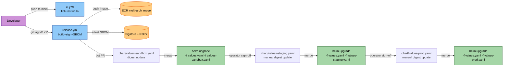

# Deployment Architecture — zip-extraction (UOW-SVC-12)

**Document Type**: Deployment & Build Architecture
**Phase**: CONSTRUCTION — Infrastructure Design (Part 2: Generation)
**Generated**: 2026-05-24
**Unit**: `zip-extraction` (UOW-SVC-12)

This document defines the **build, package, and deploy** architecture for the unit: the Helm chart shape, the Dockerfile, the CI workflow, the multi-environment values layout, the image-pinning strategy, and the chart README's platform-team-integration content.

The companion document `infrastructure-design.md` documents the AWS / K8s resource shapes themselves. This document is about *how the application gets there*.

---

## 1. Repository Layout (for code generation)

```
services/zip-extraction/
├── cmd/
│   └── zip-extraction/
│       └── main.go
├── internal/
│   ├── app/
│   ├── sqs/
│   ├── extraction/
│   ├── bombdefence/
│   ├── validation/
│   ├── storage/
│   ├── dynamodb/
│   ├── slipsheet/
│   ├── retry/
│   ├── metrics/
│   ├── health/
│   ├── config/
│   ├── awsclients/
│   └── log/
├── test/
│   ├── e2e/                    # Gate 2 Testcontainers + LocalStack
│   ├── generators/             # PBT generator catalogue (PBT-07)
│   └── testdata/               # Golden archives incl. bomb fixtures
├── chart/
│   ├── Chart.yaml
│   ├── values.yaml             # canonical defaults
│   ├── values-sandbox.yaml     # per-env overlays (Q1 of infra plan)
│   ├── values-staging.yaml
│   ├── values-prod.yaml
│   ├── README.md               # platform-team integration guidance
│   └── templates/
│       ├── deployment.yaml
│       ├── service.yaml
│       ├── configmap.yaml
│       ├── serviceaccount.yaml
│       └── _helpers.tpl
├── deploy/
│   └── docker-compose.yml      # local dev (LocalStack + service)
├── tools/
│   └── go.mod                  # pinned CLI tools (golangci-lint, govulncheck, syft)
├── .github/
│   └── workflows/
│       ├── ci.yml              # PR + push CI
│       └── release.yml         # tag-triggered release: build + sign + bot PR
├── .golangci.yml
├── .dockerignore
├── Dockerfile                  # multi-stage, multi-arch
├── Makefile                    # build / test / lint / up / down / bootstrap / docker / run / pbt-replay
├── go.mod
├── go.sum
├── README.md                   # service-level overview
├── dependabot.yml
└── renovate.json
```

---

## 2. Helm Chart Structure

### 2.1 Chart.yaml

```yaml
apiVersion: v2
name: zip-extraction
description: AI-DLC-generated Helm chart for the UOW-SVC-12 zip extraction service.
type: application
version: 0.1.0          # Chart SemVer; bumped on each release
appVersion: "0.1.0"     # Application SemVer (matches Go module / image tag)
kubeVersion: ">=1.27.0"
maintainers:
  - name: doc-uploader-team
    email: doc-uploader@<company>
home: https://github.com/<org>/doc-uploader
```

### 2.2 Canonical `values.yaml` (defaults)

```yaml
# values.yaml — canonical defaults; environment overlays override only what differs.

replicaCount: 2

image:
  repository: 537462380503.dkr.ecr.eu-west-1.amazonaws.com/doc-uploader-sandbox/zip-extraction
  tag: "0.1.0"                # human-readable
  digest: ""                  # REQUIRED in per-env overlay; sha256:... (Q2 of infra plan)
  pullPolicy: IfNotPresent

serviceAccount:
  create: true
  name: zip-extraction
  roleArn: ""                 # REQUIRED in per-env overlay (IRSA role ARN)

service:
  type: ClusterIP
  port: 8080

resources:
  requests:
    cpu: 250m
    memory: 96Mi
  limits:
    memory: 128Mi              # no CPU limit per NFR-Z-003

terminationGracePeriodSeconds: 270

podSecurityContext:
  runAsNonRoot: true
  runAsUser: 65532
  runAsGroup: 65532
  fsGroup: 65532
  seccompProfile:
    type: RuntimeDefault

containerSecurityContext:
  allowPrivilegeEscalation: false
  readOnlyRootFilesystem: true
  capabilities:
    drop: [ALL]

volumes:
  tmp:                          # emptyDir for AWS SDK transient files
    enabled: true
    medium: ""                  # empty = default node disk; set "Memory" for tmpfs

probes:
  liveness:
    path: /healthz/live
    port: 8080
    initialDelaySeconds: 5
    periodSeconds: 10
    failureThreshold: 3
  readiness:
    path: /healthz/ready
    port: 8080
    initialDelaySeconds: 2
    periodSeconds: 5
    failureThreshold: 3

# topologySpread is documented for platform-team-applied policy; not enforced by this chart.
# topologySpreadConstraints:
#   - maxSkew: 1
#     topologyKey: topology.kubernetes.io/zone
#     whenUnsatisfiable: ScheduleAnyway
#     labelSelector: { matchLabels: { app.kubernetes.io/name: zip-extraction } }

# Infrastructure references — REQUIRED in per-env overlays.
infra:
  region: eu-west-1
  awsEndpointUrl: ""            # empty in prod; "http://localstack:4566" locally
  queueUrl: ""                  # REQUIRED in overlay
  stagingBucket: ""             # REQUIRED in overlay
  dynamoTable: pipeline_files

# SSE strategy (Q6 of NFR design)
sse:
  mode: "SSE-S3"                # "SSE-S3" | "SSE-KMS"
  kmsKeyId: ""                  # populated only when mode == "SSE-KMS"

# Logging (Q10 of requirements)
logging:
  format: json                  # "json" | "console"
  level: info

# Tunable limits — rendered into ConfigMap (FR-14, NFR-7)
bombDefence:
  maxCompressedSizeBytes:     524288000
  maxExtractedSizeBytes:      2147483648
  maxCompressionRatio:        1000     # bumped from 100 — see business-rules.md BR-BOMB-004 rationale
  maxEntryCount:              10000
  maxDirectoryDepth:          10
  maxSingleFileSizeBytes:     262144000
  maxExtractionDurationSec:   240

streaming:
  maxInMemoryBufferBytes:     4194304
  multipartThresholdBytes:    5242880

retry:
  maxAttempts:                3
  backoffBaseMillis:          200
  backoffFactor:              2.0
  jitterFraction:             0.25

sqs:
  heartbeatIntervalSec:       30
  maxInFlight:                5
  gracefulShutdownTimeoutSec: 250

http:
  port:                       8080
```

### 2.3 Per-environment overlays (Q1 of infra plan)

**`values-sandbox.yaml`** — overrides only env-specific keys:

```yaml
image:
  digest: "sha256:0000000000000000000000000000000000000000000000000000000000000000"  # populated by CI release bot

serviceAccount:
  roleArn: "arn:aws:iam::<sandbox-account>:role/zip-extraction-sandbox"

infra:
  queueUrl: "https://sqs.eu-west-1.amazonaws.com/<sandbox-account>/zip-extraction-queue"
  stagingBucket: "doc-uploader-staging-sandbox-eu-west-1"

sse:
  mode: "SSE-S3"

logging:
  level: debug                # verbose in sandbox
```

**`values-staging.yaml`**:

```yaml
image:
  digest: "sha256:<populated-by-CI>"

serviceAccount:
  roleArn: "arn:aws:iam::<staging-account>:role/zip-extraction-staging"

infra:
  queueUrl: "https://sqs.eu-west-1.amazonaws.com/<staging-account>/zip-extraction-queue"
  stagingBucket: "doc-uploader-staging-eu-west-1"

sse:
  mode: "SSE-KMS"
  kmsKeyId: "arn:aws:kms:eu-west-1:<staging-account>:key/<id>"
```

**`values-prod.yaml`**:

```yaml
replicaCount: 3              # production starts at higher floor

image:
  digest: "sha256:<populated-by-CI>"

serviceAccount:
  roleArn: "arn:aws:iam::<prod-account>:role/zip-extraction-prod"

infra:
  queueUrl: "https://sqs.eu-west-1.amazonaws.com/<prod-account>/zip-extraction-queue"
  stagingBucket: "doc-uploader-staging-prod-eu-west-1"

sse:
  mode: "SSE-KMS"
  kmsKeyId: "arn:aws:kms:eu-west-1:<prod-account>:key/<id>"

sqs:
  maxInFlight: 5             # could tune per env (e.g., 10 in prod if memory allows)
```

### 2.4 Templates

**`chart/templates/deployment.yaml`** (sketch):
```yaml
apiVersion: apps/v1
kind: Deployment
metadata:
  name: {{ .Release.Name }}
  labels: {{- include "zip-extraction.labels" . | nindent 4 }}
spec:
  replicas: {{ .Values.replicaCount }}
  selector:
    matchLabels: {{- include "zip-extraction.selectorLabels" . | nindent 6 }}
  strategy:
    type: RollingUpdate
    rollingUpdate: { maxUnavailable: 1, maxSurge: 1 }
  template:
    metadata:
      labels: {{- include "zip-extraction.selectorLabels" . | nindent 8 }}
      annotations:
        checksum/config: {{ include (print $.Template.BasePath "/configmap.yaml") . | sha256sum }}
    spec:
      serviceAccountName: {{ include "zip-extraction.serviceAccountName" . }}
      terminationGracePeriodSeconds: {{ .Values.terminationGracePeriodSeconds }}
      securityContext: {{- toYaml .Values.podSecurityContext | nindent 8 }}
      containers:
        - name: zip-extraction
          image: "{{ .Values.image.repository }}{{ if .Values.image.digest }}@{{ .Values.image.digest }}{{ else }}:{{ .Values.image.tag }}{{ end }}"
          imagePullPolicy: {{ .Values.image.pullPolicy }}
          securityContext: {{- toYaml .Values.containerSecurityContext | nindent 12 }}
          env:
            - name: AWS_REGION
              value: {{ .Values.infra.region }}
            - name: AWS_ENDPOINT_URL
              value: {{ .Values.infra.awsEndpointUrl | quote }}
            - name: QUEUE_URL
              value: {{ .Values.infra.queueUrl | quote }}
            - name: STAGING_BUCKET
              value: {{ .Values.infra.stagingBucket | quote }}
            - name: DYNAMO_TABLE
              value: {{ .Values.infra.dynamoTable | quote }}
            - name: LOG_FORMAT
              value: {{ .Values.logging.format | quote }}
            - name: LOG_LEVEL
              value: {{ .Values.logging.level | quote }}
            - name: HTTP_PORT
              value: {{ .Values.http.port | quote }}
            - name: SSE_MODE
              value: {{ .Values.sse.mode | quote }}
            {{- if eq .Values.sse.mode "SSE-KMS" }}
            - name: SSE_KMS_KEY_ID
              value: {{ .Values.sse.kmsKeyId | quote }}
            {{- end }}
            - name: CONFIG_PATH
              value: /etc/zip-extraction/config.yaml
          ports:
            - { name: http, containerPort: {{ .Values.http.port }} }
          resources: {{- toYaml .Values.resources | nindent 12 }}
          livenessProbe:
            httpGet: { path: {{ .Values.probes.liveness.path }}, port: http }
            initialDelaySeconds: {{ .Values.probes.liveness.initialDelaySeconds }}
            periodSeconds: {{ .Values.probes.liveness.periodSeconds }}
            failureThreshold: {{ .Values.probes.liveness.failureThreshold }}
          readinessProbe:
            httpGet: { path: {{ .Values.probes.readiness.path }}, port: http }
            initialDelaySeconds: {{ .Values.probes.readiness.initialDelaySeconds }}
            periodSeconds: {{ .Values.probes.readiness.periodSeconds }}
            failureThreshold: {{ .Values.probes.readiness.failureThreshold }}
          volumeMounts:
            - { name: tmp, mountPath: /tmp }
            - { name: config, mountPath: /etc/zip-extraction, readOnly: true }
      volumes:
        - { name: tmp, emptyDir: { medium: "{{ .Values.volumes.tmp.medium }}" } }
        - name: config
          configMap:
            name: {{ .Release.Name }}-config
```

**`chart/templates/service.yaml`**:
```yaml
apiVersion: v1
kind: Service
metadata:
  name: {{ .Release.Name }}
  labels: {{- include "zip-extraction.labels" . | nindent 4 }}
spec:
  type: {{ .Values.service.type }}
  selector: {{- include "zip-extraction.selectorLabels" . | nindent 4 }}
  ports:
    - { name: http, port: {{ .Values.service.port }}, targetPort: http, protocol: TCP }
```

**`chart/templates/configmap.yaml`**:
```yaml
apiVersion: v1
kind: ConfigMap
metadata:
  name: {{ .Release.Name }}-config
  labels: {{- include "zip-extraction.labels" . | nindent 4 }}
data:
  config.yaml: |
    bombDefence:
      maxCompressedSizeBytes:     {{ .Values.bombDefence.maxCompressedSizeBytes }}
      maxExtractedSizeBytes:      {{ .Values.bombDefence.maxExtractedSizeBytes }}
      maxCompressionRatio:        {{ .Values.bombDefence.maxCompressionRatio }}
      maxEntryCount:              {{ .Values.bombDefence.maxEntryCount }}
      maxDirectoryDepth:          {{ .Values.bombDefence.maxDirectoryDepth }}
      maxSingleFileSizeBytes:     {{ .Values.bombDefence.maxSingleFileSizeBytes }}
      maxExtractionDurationSec:   {{ .Values.bombDefence.maxExtractionDurationSec }}
    streaming:
      maxInMemoryBufferBytes:     {{ .Values.streaming.maxInMemoryBufferBytes }}
      multipartThresholdBytes:    {{ .Values.streaming.multipartThresholdBytes }}
    retry:
      maxAttempts:                {{ .Values.retry.maxAttempts }}
      backoffBaseMillis:          {{ .Values.retry.backoffBaseMillis }}
      backoffFactor:              {{ .Values.retry.backoffFactor }}
      jitterFraction:             {{ .Values.retry.jitterFraction }}
    sqs:
      heartbeatIntervalSec:       {{ .Values.sqs.heartbeatIntervalSec }}
      maxInFlight:                {{ .Values.sqs.maxInFlight }}
      gracefulShutdownTimeoutSec: {{ .Values.sqs.gracefulShutdownTimeoutSec }}
```

**`chart/templates/serviceaccount.yaml`**:
```yaml
{{- if .Values.serviceAccount.create -}}
apiVersion: v1
kind: ServiceAccount
metadata:
  name: {{ include "zip-extraction.serviceAccountName" . }}
  annotations:
    eks.amazonaws.com/role-arn: {{ .Values.serviceAccount.roleArn | quote }}
  labels: {{- include "zip-extraction.labels" . | nindent 4 }}
{{- end }}
```

**`chart/templates/_helpers.tpl`** — standard Helm helper template with `zip-extraction.name`, `zip-extraction.fullname`, `zip-extraction.labels`, `zip-extraction.selectorLabels`, `zip-extraction.serviceAccountName`.

### 2.5 Chart README content — platform-team integration

The README documents (NOT generates) these out-of-chart resources:

| Topic | Content |
|---|---|
| IRSA role + trust policy | Full policy JSON template (see `infrastructure-design.md` §2.4) |
| HPA / KEDA `ScaledObject` | `min 2 / max 10`, trigger on `ApproximateNumberOfMessagesVisible / maxInFlight ≈ 1` (NFR-Z-002) |
| NetworkPolicy egress allowlist | FQDN list + CIDR-from-`ip-ranges.json` recommendation + DNS to CoreDNS (Q6 of infra plan) |
| VPC endpoints | Recommended Gateway endpoints (S3, DDB) + Interface endpoints (SQS, STS) (Q5 of infra plan) |
| Prometheus `ServiceMonitor` | Selector labels + scrape path + interval |
| Recommended alert rules | 5 PromQL alerts (NFR-Z-062) |
| SLI dashboard | 6 PromQL queries (NFR-Z §11) |
| CloudWatch log group | Retention ≥ 90 days; no `DeleteLogStream` in IRSA |
| S3 bucket policy | Deny non-TLS template (`infrastructure-design.md` §4.1) |
| SQS redrive | Visibility 300s + maxReceiveCount 3 (`infrastructure-design.md` §3.1) |
| Promotion across environments | `helm upgrade -f values.yaml -f values-<env>.yaml ...` + bot-PR digest workflow |

---

## 3. Dockerfile

```dockerfile
# syntax=docker/dockerfile:1.6

# ---------- Builder stage ----------
FROM --platform=$BUILDPLATFORM golang:1.24-bookworm@sha256:<digest> AS builder
ARG TARGETOS TARGETARCH
WORKDIR /src
COPY go.mod go.sum ./
RUN --mount=type=cache,target=/go/pkg/mod \
    go mod download
COPY . .
RUN --mount=type=cache,target=/root/.cache/go-build \
    --mount=type=cache,target=/go/pkg/mod \
    CGO_ENABLED=0 GOOS=${TARGETOS} GOARCH=${TARGETARCH} \
    go build \
        -trimpath \
        -ldflags="-s -w -X main.version=${VERSION:-dev}" \
        -o /out/zip-extraction \
        ./cmd/zip-extraction

# ---------- Final stage ----------
FROM gcr.io/distroless/static-debian12:nonroot@sha256:<digest>
WORKDIR /app
COPY --from=builder /out/zip-extraction /app/zip-extraction
USER 65532:65532
ENTRYPOINT ["/app/zip-extraction"]
```

**Notes**:
- `--platform=$BUILDPLATFORM` + `ARG TARGETOS TARGETARCH` enable multi-arch via `docker buildx build --platform linux/amd64,linux/arm64 ...` (Q3 of infra plan).
- Both base images pinned by digest (Q2 of infra plan, SECURITY-10).
- `-trimpath` removes local filesystem paths from the binary (reproducible builds).
- `-ldflags="-s -w"` strips symbols (smaller image).
- `CGO_ENABLED=0` produces a static binary suitable for the distroless image.
- `USER 65532` matches the `runAsUser` in the pod `securityContext`.

---

## 4. Makefile

```makefile
SHELL := /usr/bin/env bash
.SHELLFLAGS := -eu -o pipefail -c

GO         ?= go
GOLANGCI   ?= golangci-lint
GOVULN     ?= govulncheck
SYFT       ?= syft
COSIGN     ?= cosign
DOCKER     ?= docker
COMPOSE    ?= docker compose
HELM       ?= helm

IMG_REPO   ?= 537462380503.dkr.ecr.eu-west-1.amazonaws.com/doc-uploader-sandbox/zip-extraction
IMG_TAG    ?= dev-$(shell git rev-parse --short HEAD 2>/dev/null || echo "untracked")
PLATFORMS  ?= linux/amd64,linux/arm64

.PHONY: build test lint vuln sbom up down bootstrap run docker docker-multiarch helm-template pbt-replay clean

build:
	$(GO) build -trimpath -o bin/zip-extraction ./cmd/zip-extraction

test:
	$(GO) test -race -cover ./...

lint:
	$(GOLANGCI) run

vuln:
	$(GOVULN) ./...

sbom:
	$(SYFT) . -o cyclonedx-json=sbom.cyclonedx.json

up:                # docker-compose up: LocalStack + service
	$(COMPOSE) -f deploy/docker-compose.yml up -d

down:
	$(COMPOSE) -f deploy/docker-compose.yml down -v

bootstrap:         # provision LocalStack S3 bucket / SQS queue+DLQ / DDB table
	AWS_ENDPOINT_URL=http://localhost:4566 AWS_REGION=eu-west-1 \
		bash deploy/bootstrap-localstack.sh

run:               # run in-process against LocalStack
	AWS_ENDPOINT_URL=http://localhost:4566 \
	AWS_REGION=eu-west-1 \
	AWS_ACCESS_KEY_ID=test AWS_SECRET_ACCESS_KEY=test \
	LOG_FORMAT=console \
	QUEUE_URL=http://localhost:4566/000000000000/zip-extraction-queue \
	STAGING_BUCKET=doc-uploader-staging-local \
	DYNAMO_TABLE=pipeline_files \
	CONFIG_PATH=deploy/config-local.yaml \
	$(GO) run ./cmd/zip-extraction

docker:            # single-arch local build
	$(DOCKER) build -t $(IMG_REPO):$(IMG_TAG) .

docker-multiarch:  # multi-arch build (CI uses this)
	$(DOCKER) buildx build --platform $(PLATFORMS) -t $(IMG_REPO):$(IMG_TAG) --push .

helm-template:
	$(HELM) template zip-extraction chart -f chart/values.yaml -f chart/values-sandbox.yaml

pbt-replay:        # replay a PBT failure with the seed captured in CI
	@test -n "$$SEED" || (echo "Usage: make pbt-replay SEED=<n>" && exit 1)
	RAPID_SEED=$$SEED $(GO) test -run TestProperty ./...

clean:
	rm -rf bin/ sbom.cyclonedx.json
```

---

## 5. GitHub Actions CI Workflow

### 5.1 `.github/workflows/ci.yml` (PR + push)

```yaml
name: ci
on:
  push:
    branches: [main]
  pull_request:

permissions:
  contents: read
  pull-requests: read

jobs:
  test:
    name: lint + test + vuln
    runs-on: ubuntu-22.04
    steps:
      - uses: actions/checkout@<full-sha>
      - uses: actions/setup-go@<full-sha>
        with: { go-version: '1.24', cache: true }
      - name: Verify Go module integrity
        run: go mod verify

      - name: Lint
        uses: golangci/golangci-lint-action@<full-sha>
        with: { version: v1.60.0 }

      - name: Build
        run: go build -trimpath ./...

      - name: Test (incl. PBT)
        env: { RAPID_SEED: ${{ github.run_id }} }
        run: go test -race -cover -coverprofile=cover.out ./...

      - name: Coverage gate (>=80%)
        run: |
          go tool cover -func=cover.out | awk '/^total:/ {print $3}' \
            | sed 's/%//' | awk '{ if ($1 < 80) { print "coverage", $1, "<80%"; exit 1 } }'

      - name: govulncheck
        run: |
          go install golang.org/x/vuln/cmd/govulncheck@<pinned-version>
          govulncheck ./...
```

### 5.2 `.github/workflows/release.yml` (tag-triggered)

```yaml
name: release
on:
  push:
    tags: ['v*.*.*']

permissions:
  contents: write
  id-token: write       # cosign keyless via OIDC
  packages: write

jobs:
  build-sign-push:
    runs-on: ubuntu-22.04
    outputs:
      digest: ${{ steps.build.outputs.digest }}
    steps:
      - uses: actions/checkout@<full-sha>

      - name: AWS credentials (ECR push)
        uses: aws-actions/configure-aws-credentials@<full-sha>
        with:
          role-to-assume: arn:aws:iam::<account>:role/zip-extraction-ci-pusher
          aws-region: eu-west-1
      - uses: aws-actions/amazon-ecr-login@<full-sha>

      - name: Set up Buildx
        uses: docker/setup-buildx-action@<full-sha>

      - name: Build and push multi-arch (Q3)
        id: build
        uses: docker/build-push-action@<full-sha>
        with:
          context: .
          platforms: linux/amd64,linux/arm64
          push: true
          tags: |
            ${IMG_REPO}:${{ github.ref_name }}
          provenance: true       # SLSA provenance attestation by buildx
          sbom: true             # Buildx-generated SBOM in image manifest

      - name: Generate SBOM (syft, CycloneDX)
        uses: anchore/sbom-action@<full-sha>
        with:
          image: ${IMG_REPO}@${{ steps.build.outputs.digest }}
          format: cyclonedx-json
          output-file: sbom.cyclonedx.json

      - name: Install cosign
        uses: sigstore/cosign-installer@<full-sha>

      - name: Sign image (cosign keyless OIDC) (Q4)
        env: { COSIGN_EXPERIMENTAL: 1 }
        run: |
          cosign sign --yes ${IMG_REPO}@${{ steps.build.outputs.digest }}

      - name: Attest SBOM (in-toto)
        env: { COSIGN_EXPERIMENTAL: 1 }
        run: |
          cosign attest --yes \
            --predicate sbom.cyclonedx.json \
            --type cyclonedx \
            ${IMG_REPO}@${{ steps.build.outputs.digest }}

      - name: Attach SBOM to GitHub Release
        uses: softprops/action-gh-release@<full-sha>
        with: { files: sbom.cyclonedx.json }

  update-values:
    needs: build-sign-push
    runs-on: ubuntu-22.04
    permissions: { contents: write, pull-requests: write }
    steps:
      - uses: actions/checkout@<full-sha>
      - name: Update values-sandbox.yaml with new digest
        env: { DIGEST: ${{ needs.build-sign-push.outputs.digest }}, TAG: ${{ github.ref_name }} }
        run: |
          sed -i "s|^\\(  digest: \\).*|\\1\"${DIGEST}\"|" chart/values-sandbox.yaml
          sed -i "s|^\\(  tag: \\).*|\\1\"${TAG#v}\"|" chart/values-sandbox.yaml
      - name: Create PR
        uses: peter-evans/create-pull-request@<full-sha>
        with:
          commit-message: "chore(release): pin sandbox digest to ${TAG}"
          title: "chore(release): pin sandbox digest to ${TAG}"
          body: "Automated digest pin from release ${TAG}."
          branch: release/${{ github.ref_name }}-sandbox-pin
```

**Key properties of the CI design**:
- Reusable actions pinned by full SHA (SECURITY-10 / NFR-Z-047).
- Multi-arch image built once (Q3 of infra plan).
- Image + SBOM signed via Sigstore keyless (Q4 of infra plan).
- Sandbox digest auto-updated via bot PR after each release (Q2 of infra plan).
- Staging / Prod digest updates are explicit PRs after manual sign-off (no auto-update).

---

## 6. Multi-Environment Promotion Flow



**Promotion principles**:
- **Sandbox auto-updates** on every release tag (digest PR bot, auto-merge ok if CI passes).
- **Staging and Production updates are manual** (explicit operator PR; no auto-update). This is the gate where operators verify SBOM, run smoke tests against staging, and explicitly bump the prod digest pointer.
- **Same digest flows through all environments** (`image.digest` is byte-identical from sandbox → staging → prod). The only differences are infra references (queue URL, bucket, IRSA role) and tuning (replicaCount, log level).

---

## 7. Deployment Topology Diagram (Steady State)

```mermaid
flowchart TB
    subgraph EKS["EKS Cluster — DEV05-EKS-CLUSTER (eu-west-1)"]
        subgraph AZA["AZ a"]
            Pod1["Pod 1<br/>zip-extraction"]
        end
        subgraph AZB["AZ b"]
            Pod2["Pod 2<br/>zip-extraction"]
        end
        CM["ConfigMap<br/>zip-extraction-config"]
        SA["ServiceAccount<br/>zip-extraction<br/>(IRSA)"]
        Svc["Service<br/>zip-extraction:8080 (ClusterIP)"]
        Kubelet["kubelet<br/>(probes /healthz/*)"]
        Prom["Prometheus<br/>(/metrics scrape)"]
        Fluent["fluent-bit<br/>(stdout → CW)"]
    end

    subgraph AWS["AWS — eu-west-1"]
        SQSQ["SQS<br/>zip-extraction-queue"]
        DLQ["SQS DLQ<br/>zip-extraction-dlq"]
        S3In[("S3 staging<br/>input/")]
        S3Slip[("S3 staging<br/>slipsheets/")]
        DDB[("DynamoDB<br/>pipeline_files")]
        IAM["IAM<br/>IRSA role"]
        KMS[("KMS<br/>(SSE-KMS opt)")]
        STS["STS"]
        CW["CloudWatch Logs<br/>(90d retention)"]
        ECR[("ECR image")]
    end

    subgraph VPC["VPC endpoints (recommended)"]
        VPCS3["s3 (Gateway)"]
        VPCDDB["dynamodb (Gateway)"]
        VPCSQS["sqs (Interface)"]
        VPCSTS["sts (Interface)"]
    end

    SA -.IRSA AssumeRoleWithWebIdentity.-> STS
    STS -.via.-> VPCSTS
    Pod1 --> Svc
    Pod2 --> Svc
    Pod1 --> CM
    Pod2 --> CM
    Pod1 --> SA
    Pod2 --> SA

    Pod1 -- ReceiveMessage --> VPCSQS --> SQSQ
    Pod2 -- ReceiveMessage --> VPCSQS
    Pod1 -- GetObject --> VPCS3 --> S3In
    Pod2 -- GetObject --> VPCS3
    Pod1 -- PutObject input/ --> VPCS3
    Pod1 -- PutObject slipsheets/ --> VPCS3 --> S3Slip
    Pod1 -- PutItem --> VPCDDB --> DDB
    Pod2 -- PutItem --> VPCDDB
    Pod1 -- "PutObject (SSE-KMS only)" -.-> KMS

    SQSQ -.maxReceiveCount=3.-> DLQ

    Kubelet -- "/healthz/{live,ready}" --> Svc
    Prom -- "/metrics" --> Svc
    Pod1 -- "stdout (json)" --> Fluent --> CW
    Pod2 -- "stdout (json)" --> Fluent

    ECR -- "image pull (digest)" -.-> Pod1
    ECR -. -.-> Pod2

    style Pod1 fill:#A5D6A7,stroke:#1B5E20,color:#000
    style Pod2 fill:#A5D6A7,stroke:#1B5E20,color:#000
    style SQSQ fill:#FFCC80,stroke:#E65100,color:#000
    style DLQ fill:#FFCC80,stroke:#E65100,color:#000
    style S3In fill:#FFCC80,stroke:#E65100,color:#000
    style S3Slip fill:#FFCC80,stroke:#E65100,color:#000
    style DDB fill:#FFCC80,stroke:#E65100,color:#000
    style VPCS3 fill:#CE93D8,stroke:#6A1B9A,color:#000
    style VPCDDB fill:#CE93D8,stroke:#6A1B9A,color:#000
    style VPCSQS fill:#CE93D8,stroke:#6A1B9A,color:#000
    style VPCSTS fill:#CE93D8,stroke:#6A1B9A,color:#000
```

---

## 8. Compliance Summary

| Concern | Where addressed in this deployment architecture |
|---|---|
| **SECURITY-10 supply chain** | Multi-stage Dockerfile pins both bases by digest (§3); CI release pipeline pins all actions by SHA (§5); image is signed via cosign (§5); SBOM is attested via cosign (§5); `image.digest` pinned in per-env values (§2.2) |
| **SECURITY-13 integrity** | Sigstore Rekor transparency log records every signature; SBOM attestations are verifiable post-hoc |
| **SECURITY-09 hardening** | Distroless non-root final image (§3); restricted PSS `securityContext` (§2.2) |
| **SECURITY-06 least privilege** | IRSA role with explicit per-resource actions; KMS permission only when SSE-KMS active (`infrastructure-design.md` §2.4) |
| **NFR-Z-001..049** | Helm `values.yaml` defaults match every NFR-Z parameter |
| **NFR-Z-090/091 parity** | Same image, same code, same chart — only `values-<env>.yaml` and env vars differ between environments |

**No blocking findings at the Infrastructure Design stage.**
