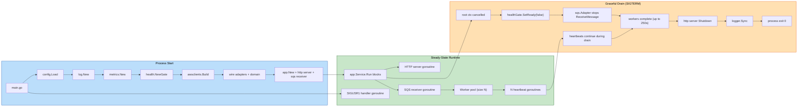

# Logical Components — zip-extraction (UOW-SVC-12)

**Document Type**: Logical Component Inventory + Infrastructure Dependencies
**Phase**: CONSTRUCTION — NFR Design (Part 2: Generation)
**Generated**: 2026-05-24
**Unit**: `zip-extraction` (UOW-SVC-12)

This document records the **runtime logical components** (constructed and wired at startup) and the **infrastructure dependencies** the pod relies on externally. It is the bridge between the NFR design patterns (`nfr-design-patterns.md`) and the Code Generation stage that follows.

Logical components are grouped into:

1. **In-pod logical components** — instances constructed and held in memory throughout the pod's lifetime
2. **Out-of-pod infrastructure dependencies** — AWS / Kubernetes resources owned by the platform team but consumed by this service
3. **Dependency-injection wiring summary** — how the components are connected in `cmd/zip-extraction/main.go`

---

## 1. In-Pod Logical Components

Each entry: **Component (Go package symbol) — Lifecycle — Responsibilities — Configurable inputs — Concurrency notes — NFR-Z source — Design pattern.**

### 1.1 Configuration loader
**Component**: `internal/config.Config` (value type returned by `internal/config.Load`)
**Lifecycle**: Constructed once at process start; immutable thereafter.
**Responsibilities**: Read env vars (infra: queue URL, bucket, table, region, endpoint, log format, http port) + parse YAML at `CONFIG_PATH` (limits: bomb defence, streaming, retry, sqs).
**Configurable inputs**: `CONFIG_PATH` env var (default `/etc/zip-extraction/config.yaml`); standard 12-factor env vars per FR-14.
**Concurrency notes**: Read-only; safe to share by value across goroutines.
**NFR-Z source**: FR-14, NFR-7 of requirements, NFR-Z-050
**Design pattern**: §4.7 strict YAML decode + fail-fast validation.

### 1.2 Structured logger
**Component**: `internal/log.Logger` (interface) backed by `*zap.Logger` (production or development config selected by `LOG_FORMAT`).
**Lifecycle**: Constructed once in `main` after config loads. Lives until process exit.
**Responsibilities**: All logging across the codebase. Provides `With(fields...)` for per-message child loggers. Filters sensitive fields per the deny-list.
**Configurable inputs**: `cfg.Logging.Format`, `cfg.Logging.Level`, version string.
**Concurrency notes**: `*zap.Logger` is concurrent-safe by design.
**NFR-Z source**: NFR-Z-042
**Design pattern**: §4.4 log redaction, §5.2 log discipline.

### 1.3 AWS client set (singleton)
**Component**: `internal/awsclients.Set` containing `*sqs.Client`, `*s3.Client`, `*dynamodb.Client`, `*s3manager.Uploader`.
**Lifecycle**: Constructed once in `main`. Shared by all adapters (single connection pool per service).
**Responsibilities**: SDK clients carrying credentials (via IRSA auto-discovery), region, endpoint override (LocalStack), retry mode (adaptive), middleware.
**Configurable inputs**: `cfg.Infra.AWSRegion`, `cfg.Infra.AWSEndpointURL`.
**Concurrency notes**: SDK clients are concurrent-safe per AWS documentation.
**NFR-Z source**: FR-15.1, NFR-Z-013
**Design pattern**: §3.4 singleton clients, §2.3 SDK adaptive retry.

### 1.4 Metrics registry
**Component**: `internal/metrics.Metrics` (struct holding 8 typed collectors).
**Lifecycle**: Constructed once in `main` and registered on `prometheus.DefaultRegisterer`.
**Responsibilities**: Provide typed API for emitting all FR-13.2 metrics + 2 operational metrics (redelivery skips, slipsheet write failures).
**Configurable inputs**: histogram buckets are constants in the package.
**Concurrency notes**: Prometheus collectors are concurrent-safe.
**NFR-Z source**: NFR-Z-060
**Design pattern**: §5.1 metrics taxonomy.

### 1.5 Health gate
**Component**: `internal/health.Gate` (atomic boolean wrapper).
**Lifecycle**: Constructed in `main`; flipped to `true` after startup health checks pass; flipped to `false` on SIGTERM (before drain wait).
**Responsibilities**: Single source of truth for `/healthz/ready` HTTP response.
**Configurable inputs**: none.
**Concurrency notes**: Atomic ops; safe for concurrent reads and writes.
**NFR-Z source**: NFR-Z-061, NFR-Z-022
**Design pattern**: §5.3 health probes.

### 1.6 HTTP operational server
**Component**: `internal/health.Server` (wraps `*http.Server`).
**Lifecycle**: Started as a goroutine by `app.Service.Run`; shut down via `http.Server.Shutdown(ctx)` in the drain sequence.
**Responsibilities**: Serve `/healthz/{live,ready}` + `/metrics` on a single port (Q3 of application design).
**Configurable inputs**: `cfg.HTTP.Port` (default 8080).
**Concurrency notes**: Standard `net/http` server; concurrent request handling via Go runtime.
**NFR-Z source**: NFR-Z-061, FR-13.1
**Design pattern**: §5.3 health probes, §4.5 distroless (no debug routes).

### 1.7 Retry classifier
**Component**: `internal/retry.Retrier` (struct with `Config`, `extraction.Clock`, `*rand.Rand`, `Logger`).
**Lifecycle**: Constructed once; consumed by `extraction.Service.processEntry` for every retryable op.
**Responsibilities**: Invoke `op` and retry on `*TransientError` up to `MaxAttempts`. Inject jittered exponential backoff via `BackoffFor`. Classify AWS SDK errors via `Classify`.
**Configurable inputs**: `cfg.Retry.MaxAttempts`, `cfg.Retry.BackoffBaseMillis`, `cfg.Retry.BackoffFactor`, `cfg.Retry.JitterFraction`.
**Concurrency notes**: Holds `*rand.Rand` which is NOT concurrent-safe; access serialised by sync.Mutex internal to Retrier (or use `rand/v2`'s `ChaCha8` source which IS concurrent-safe in Go 1.22+).
**NFR-Z source**: NFR-Z-030, NFR-Z-031
**Design pattern**: §1.1 classifier-driven retry.

### 1.8 Path validator
**Component**: `internal/validation.PathValidator` (stateless).
**Lifecycle**: Constructed once; consumed by `extraction.Service.processEntry`.
**Responsibilities**: Sanitise ZIP entry paths; reject traversal, absolute, empty, invalid-filename.
**Configurable inputs**: none (rules are fixed).
**Concurrency notes**: Pure function; concurrent-safe.
**NFR-Z source**: NFR-Z-043
**Design pattern**: §3.2 streaming-friendly (no I/O), §4.4 (rejects malicious inputs).

### 1.9 Bomb-defence checker
**Component**: `internal/bombdefence.Checker` (stateless with `Config`).
**Lifecycle**: Constructed once; consumed by `extraction.Service.Process` for pre-check + per-entry checks + `NewLimitedReader` factory.
**Responsibilities**: Apply all 10 bomb-defence rules (pre-check, per-entry, streaming, path-validation delegation).
**Configurable inputs**: `cfg.BombDefence.*` (7 thresholds).
**Concurrency notes**: Pre-check / per-entry are stateless; `LimitedReader` instances have per-stream state (cumulative counters) and are NOT shared across goroutines.
**NFR-Z source**: NFR-Z-014, NFR-Z-043
**Design pattern**: §3.2 short-circuiting LimitedReader.

### 1.10 Slipsheet writer
**Component**: `internal/slipsheet.Writer` (wraps `S3Uploader` port + `Config`).
**Lifecycle**: Constructed once; consumed by `extraction.Service.Process` defer block.
**Responsibilities**: Marshal `Slipsheet` to JSON; upload to `slipsheets/{execId}.json`.
**Configurable inputs**: `cfg.Infra.StagingBucket`, key prefix constant `slipsheets/`.
**Concurrency notes**: Stateless beyond holding the uploader port; concurrent-safe.
**NFR-Z source**: FR-8, NFR-Z-033
**Design pattern**: §1.4 deterministic key, §3.1 streaming I/O (JSON is small, one PUT).

### 1.11 DynamoDB recorder
**Component**: `internal/dynamodb.Adapter` (wraps `DDBClient` + table name).
**Lifecycle**: Constructed once; consumed by `extraction.Service.processEntry`.
**Responsibilities**: Conditional PutItem; marshal/unmarshal `PipelineFile`.
**Configurable inputs**: `cfg.Infra.DynamoTable`.
**Concurrency notes**: Concurrent-safe via SDK client.
**NFR-Z source**: NFR-Z-033, FR-5
**Design pattern**: §1.4 deterministic key + conditional write.

### 1.12 S3 storage adapter
**Component**: `internal/storage.Adapter` (wraps `S3Client`, `S3Uploader`, `Config`).
**Lifecycle**: Constructed once; consumed by `extraction.Service.processEntry` + `slipsheet.Writer`.
**Responsibilities**: Download (streaming `GetObject`), Upload (single PUT or multipart based on threshold).
**Configurable inputs**: `cfg.Streaming.MultipartThresholdBytes`, `cfg.SSE` (Helm-rendered into env vars / YAML).
**Concurrency notes**: Concurrent-safe via SDK client.
**NFR-Z source**: NFR-Z-013, NFR-Z-040
**Design pattern**: §3.3 multipart upload, §3.5 hybrid MIME, §4.2 SSE mode.

### 1.13 SQS adapter (receive loop + heartbeater)
**Component**: `internal/sqs.Adapter` (wraps `SQSClient` + `Config` + `Heartbeater`).
**Lifecycle**: Constructed once; `Run(ctx, handler)` started as a goroutine by `app.Service.Run`.
**Responsibilities**: Long-poll `ReceiveMessage`, dispatch to bounded worker pool, schedule per-message heartbeat goroutines, `DeleteMessage` on terminal status, drain on ctx cancellation.
**Configurable inputs**: `cfg.SQS.MaxInFlight`, `cfg.SQS.HeartbeatIntervalSec`, `cfg.SQS.GracefulShutdownTimeoutSec`.
**Concurrency notes**: One long-poll goroutine + N worker goroutines + N heartbeat goroutines, where N ≤ MaxInFlight (default 5). Total ≤ 11.
**NFR-Z source**: NFR-Z-001, NFR-Z-034, NFR-Z-022
**Design pattern**: §2.1 bounded worker pool, §1.2 per-message heartbeat, §1.3 graceful drain.

### 1.14 Extraction orchestrator
**Component**: `internal/extraction.Service`.
**Lifecycle**: Constructed once; consumed per-message by SQS dispatch.
**Responsibilities**: Per-message lifecycle: download → open zip → pre-check → per-entry loop → slipsheet write → cleanup. Owns the typed-error hierarchy.
**Configurable inputs**: `cfg.BombDefence.MaxExtractionDurationSec` (context timeout for rule #10), plus all dependencies injected via ports.
**Concurrency notes**: A `*Service` is concurrent-safe — `Process(ctx, msg)` is re-entrant.
**NFR-Z source**: many (see cross-reference matrix in `nfr-design-patterns.md`)
**Design pattern**: §1.4 deterministic idempotency, §1.5 fail-closed, §3.1 streaming I/O.

### 1.15 App orchestrator
**Component**: `internal/app.Service`.
**Lifecycle**: Constructed once in `main`; `Run(ctx)` blocks until ctx cancelled.
**Responsibilities**: Wire all subsystems; manage startup health checks → readiness flip → steady state → drain → shutdown.
**Configurable inputs**: full `Config` value + `Dependencies` struct (port injection root).
**Concurrency notes**: Owns the SQS receive-loop goroutine and the HTTP server goroutine.
**NFR-Z source**: NFR-Z-022 (drain orchestration)
**Design pattern**: §1.3 graceful drain.

### 1.16 SIGUSR1 heap-dump handler (operational tool)
**Component**: anonymous goroutine in `cmd/zip-extraction/main.go`.
**Lifecycle**: Registered at startup; lives for process lifetime.
**Responsibilities**: On SIGUSR1, write a heap profile to `/tmp/heap-<RFC3339-timestamp>.pprof` via `runtime/pprof.WriteHeapProfile`.
**Configurable inputs**: none.
**Concurrency notes**: Signal handling on a dedicated goroutine; no contention with the main path.
**NFR-Z source**: implicit — emergency-profiling tool (Q4 of NFR design plan)
**Design pattern**: §4.6 no-pprof-endpoint.

---

## 2. Out-of-Pod Infrastructure Dependencies

These resources live outside the pod and outside this repository (provisioned by the platform team). The service depends on their existence + configuration. The chart README documents the contract.

### 2.1 SQS main queue
**Resource**: `arn:aws:sqs:eu-west-1:<account>:zip-extraction-queue`
**Owner**: Platform team
**Contract**:
- Visibility timeout: 300 s (matches `cfg.SQS` heartbeat target)
- DLQ redrive: `RedrivePolicy: { deadLetterTargetArn: <dlq-arn>, maxReceiveCount: 3 }`
- Message retention: 4 days (default)
- Encryption at rest: SSE enabled (KMS-managed or AWS-managed acceptable)
**Configurable inputs (from service)**: queue URL via `cfg.Infra.QueueURL` env var.
**Failure behaviour**: pod's `/healthz/ready` returns 503 if `ReceiveMessage` 4xx-errors at startup; SQS unavailability → service won't become ready.
**NFR-Z source**: NFR-Z-002, NFR-Z-022, FR-1, FR-9

### 2.2 SQS dead-letter queue
**Resource**: `arn:aws:sqs:eu-west-1:<account>:zip-extraction-dlq`
**Owner**: Platform team
**Contract**:
- Message retention: 14 days minimum
- Alarm on `ApproximateNumberOfMessagesVisible > 5` for 10 min (chart README Alert recommendation)
**Configurable inputs**: DLQ ARN referenced from the main queue's redrive policy; not directly consumed by service code.
**Failure behaviour**: DLQ contains messages that failed extraction unrecoverably (panics + transient source-archive download failures per BR-DLQ-002 / BR-DLQ-003).
**NFR-Z source**: BR-DLQ-001..004

### 2.3 S3 staging bucket
**Resource**: `arn:aws:s3:::<staging-bucket>`
**Owner**: Platform team
**Contract**:
- SSE: SSE-S3 enabled by default; SSE-KMS with customer-managed key optional per Q6 of NFR design plan
- Bucket policy: denies non-TLS requests (SECURITY-01)
- Public-access block: enabled (SECURITY-09)
- Lifecycle policy on `input/` prefix: object expiration after 7 days (handles bomb-defence orphans per BR-BOMB-006 + accidental retention prevention)
- Lifecycle policy on `slipsheets/` prefix: longer retention (e.g., 90 days) for audit purposes
- S3 PutObject event notifications on `input/` prefix only → downstream pipeline trigger; `slipsheets/` prefix has NO event notifications
**Configurable inputs (from service)**: `cfg.Infra.StagingBucket`.
**Failure behaviour**: 4xx on upload → `*PermanentError` per BR-RETRY-008; archive marked FAILED.
**NFR-Z source**: NFR-Z-040, NFR-Z-041, BR-SLIP-001

### 2.4 DynamoDB pipeline_files table
**Resource**: `arn:aws:dynamodb:eu-west-1:<account>:table/pipeline_files`
**Owner**: Platform team
**Contract**:
- Primary key: `pk` (string) + `sk` (string)
- Encryption at rest: AWS-managed key (default; KMS optional)
- PITR (Point-in-Time-Recovery) enabled
- Capacity: on-demand mode (recommended) OR provisioned with auto-scaling
**Configurable inputs (from service)**: `cfg.Infra.DynamoTable`.
**Failure behaviour**: `ProvisionedThroughputExceededException` → `*TransientError{Class:"throttling"}` → retry; chronic → `*PermanentError` → entry FAILED.
**NFR-Z source**: NFR-Z-033, FR-5

### 2.5 IRSA role + Kubernetes ServiceAccount
**Resource**: IAM role + EKS-pod-identity-bound K8s SA
**Owner**: Platform team (IAM); this repo (K8s SA template)
**Contract**:
- IAM policy contains ONLY the actions listed in NFR-Z-044 (no wildcards)
- Trust policy scoped to the K8s SA via OIDC condition
- Helm chart `serviceaccount.yaml` adds `eks.amazonaws.com/role-arn: <role-arn>` annotation
**Configurable inputs**: Helm `serviceAccount.roleArn`.
**Failure behaviour**: missing / invalid IRSA → SDK credential resolution fails at startup → service exits non-zero.
**NFR-Z source**: NFR-Z-044, NFR-Z-049

### 2.6 KMS key (optional, SSE-KMS mode only)
**Resource**: `arn:aws:kms:eu-west-1:<account>:key/<id>`
**Owner**: Platform team
**Contract**:
- Key policy permits the IRSA role's `kms:Decrypt` + `kms:GenerateDataKey` actions
- Key state: Enabled
**Configurable inputs**: Helm `sse.mode: "SSE-KMS"` + `sse.kmsKeyId`. Service reads via `cfg.SSE`.
**Failure behaviour**: KMS key disabled / IRSA missing `kms:` → PutObject returns AccessDenied → `*PermanentError` → archive FAILED.
**NFR-Z source**: NFR-Z-040, NFR-Z-044 (conditional)

### 2.7 Kubernetes ConfigMap for tunable limits
**Resource**: K8s ConfigMap created by the Helm chart
**Owner**: This repo (chart) + operator (values overrides)
**Contract**:
- Mounted as a volume at `/etc/zip-extraction/config.yaml`
- Schema validated by `internal/config.Load + Validate` at startup
- Editable in Helm `values.yaml` under `bombDefence:`, `streaming:`, `retry:`, `sqs:` keys
**Configurable inputs**: full YAML schema per FR-14 + NFR-7.
**Failure behaviour**: malformed YAML → service exits non-zero (fail-fast per §4.7).
**NFR-Z source**: FR-14, NFR-Z-050

### 2.8 Kubernetes Service (in-cluster routing)
**Resource**: ClusterIP Service rendered by the Helm chart
**Owner**: This repo (chart) + cluster operator
**Contract**:
- `targetPort: 8080` for the operational HTTP server
- `selector: app.kubernetes.io/name: zip-extraction`
- No external LB (consumer is in-cluster Prometheus scraper + kubelet probes only)
**Configurable inputs**: Helm `service.type: ClusterIP`.
**Failure behaviour**: service unreachable → Prometheus loses metrics; kubelet probes fall back to pod-IP-direct (still works).
**NFR-Z source**: NFR-Z-061

### 2.9 HPA / KEDA ScaledObject
**Resource**: Autoscaler manifest (NOT rendered by this chart per Q9 of requirements)
**Owner**: Platform team
**Contract**: Chart README documents recommended bounds (min 2 / max 10) + trigger (KEDA `aws-sqs-queue` scaler on `ApproximateNumberOfMessagesVisible / maxInFlight` ≈ 1).
**Configurable inputs**: platform-team-managed.
**Failure behaviour**: no autoscaler → fixed replica count (Helm `replicaCount`); under-provisioning manifests as growing queue depth + DLQ pressure.
**NFR-Z source**: NFR-Z-002

### 2.10 NetworkPolicy (egress allowlist)
**Resource**: K8s `NetworkPolicy` (NOT rendered by this chart per Q9 of requirements)
**Owner**: Platform team
**Contract**: Chart README documents required egress: AWS service endpoints (SQS, S3, DynamoDB, STS) in `eu-west-1`. No general internet egress.
**Configurable inputs**: platform-team-managed.
**Failure behaviour**: misconfigured egress → AWS calls fail with network errors → service `/healthz/ready` 503.
**NFR-Z source**: NFR-Z-045, SECURITY-07

### 2.11 Prometheus scrape target / ServiceMonitor
**Resource**: `ServiceMonitor` CR (NOT rendered by this chart per Q9 of requirements)
**Owner**: Platform team
**Contract**: Chart README documents the labels Prometheus operator should target + scrape path (`/metrics`) + interval (15–30 s).
**Configurable inputs**: platform-team-managed.
**Failure behaviour**: no scraping → no metrics; alerts fail open.
**NFR-Z source**: NFR-Z-060, NFR-Z-062

### 2.12 CloudWatch logs ingest (EKS log driver)
**Resource**: CloudWatch Log Group via EKS cluster's `aws-for-fluent-bit` (or equivalent) DaemonSet
**Owner**: Platform team
**Contract**:
- Log group `/aws/eks/<cluster-name>/zip-extraction` (or whatever convention)
- Retention ≥ 90 days (SECURITY-14)
- Service's IRSA role does NOT have `logs:DeleteLogStream` (least privilege; SECURITY-14)
**Configurable inputs**: log-driver config is cluster-level; service just writes JSON to stdout.
**Failure behaviour**: ingest interruption → logs lost (not retried by application).
**NFR-Z source**: NFR-Z-042, SECURITY-03, SECURITY-14

---

## 3. Dependency-Injection Wiring Summary

The wiring is a single-file `cmd/zip-extraction/main.go`. The order matches the dependency graph in `application-design/component-dependency.md`.

```go
// Sketch (production code lives in cmd/zip-extraction/main.go)

func main() {
    // 0. Bootstrap
    rootCtx, cancel := signal.NotifyContext(context.Background(),
        syscall.SIGINT, syscall.SIGTERM)
    defer cancel()

    // 1. Configuration
    cfg, err := config.Load()
    if err != nil { fmt.Fprintln(os.Stderr, err); os.Exit(1) }

    // 2. Logger
    logger, err := log.New(cfg.Logging, version)
    if err != nil { fmt.Fprintln(os.Stderr, err); os.Exit(1) }
    defer logger.Sync()

    // 3. Metrics
    metricsReg := metrics.New(prometheus.DefaultRegisterer)

    // 4. Health gate (not ready yet)
    healthGate := health.NewGate()

    // 5. AWS clients (singleton)
    aws, err := awsclients.Build(rootCtx, cfg.Infra)
    if err != nil { logger.Error("awsclients.Build failed", ...); os.Exit(1) }

    // 6. Adapters (consume the singleton clients)
    s3Adapter   := storage.NewAdapter(aws.S3, aws.S3Uploader, storage.Config{
        MultipartThresholdBytes: cfg.Streaming.MultipartThresholdBytes,
        SSE: cfg.SSE,
    })
    ddbAdapter  := dynamodb.NewAdapter(aws.DDB, dynamodb.Config{TableName: cfg.Infra.DynamoTable})
    slipWriter  := slipsheet.NewWriter(s3Adapter, slipsheet.Config{
        BucketName: cfg.Infra.StagingBucket,
        KeyPrefix:  "slipsheets/",
    })

    // 7. Domain components (pure)
    checker     := bombdefence.New(cfg.BombDefence)
    pathValid   := validation.New()
    retrier     := retry.New(cfg.Retry, sysClock{}, rand.New(rand.NewSource(time.Now().UnixNano())), logger)

    // 8. Extraction orchestrator (consumes all ports)
    ext := extraction.New(extraction.Dependencies{
        Downloader:      s3Adapter,
        Uploader:        s3Adapter,
        Recorder:        ddbAdapter,
        SlipsheetWriter: slipWriter,
        BombChecker:     checker,
        PathValidator:   pathValid,
        Retrier:         retrier,
        Metrics:         metricsReg,
        Logger:          logger,
        Clock:           sysClock{},
        Config:          extraction.Config{MaxExtractionDurationSec: cfg.BombDefence.MaxExtractionDurationSec},
    })

    // 9. SQS adapter (receive loop + heartbeater)
    heart := sqs.NewHeartbeater(aws.SQS, cfg.SQS, logger)
    sqsAdapter := sqs.NewAdapter(aws.SQS, cfg.SQS, heart)

    // 10. HTTP operational server
    httpSrv := health.NewServer(cfg.HTTP.Port, healthGate)

    // 11. SIGUSR1 heap dump goroutine (operational tool, Q4 decision)
    go installHeapDumpHandler(logger)

    // 12. App orchestrator
    app := app.New(cfg, app.Dependencies{
        Logger:     logger,
        Metrics:    metricsReg,
        Queue:      sqsAdapter,
        Extractor:  ext,
        HealthGate: healthGate,
        HTTPServer: httpSrv,
    })

    // 13. Run until ctx done
    if err := app.Run(rootCtx); err != nil {
        logger.Error("app.Run returned error", zap.Error(err))
        os.Exit(1)
    }
    logger.Info("clean shutdown")
}
```

**Key wiring properties**:

- **Strict construction order**: config → logger → metrics → health gate → AWS clients → adapters → domain → orchestrators. Mirrors the layered diagram in `component-dependency.md`.
- **No package-level globals** for the wired components (everything is local to `main` and passed via constructors). Only Prometheus's `prometheus.DefaultRegisterer` is a global — convention for the ecosystem.
- **Test-time substitution**: each port has an interface; tests construct fake implementations. The wiring above is for production only.
- **`sysClock{}`**: a concrete struct implementing `extraction.Clock` that returns `time.Now()`. Tests substitute a controlled clock.
- **Graceful shutdown**: `signal.NotifyContext` cancels `rootCtx` on SIGTERM/SIGINT; `app.Run` returns; deferred `logger.Sync()` flushes the log buffer.

---

## 4. Component Lifecycle Diagram



---

## 5. Cross-Reference Matrix — Components → NFR-Z + Patterns

| Component | NFR-Z | Design Pattern |
|---|---|---|
| 1.1 Config loader | NFR-Z-050 | §4.7 strict YAML decode |
| 1.2 Logger | NFR-Z-042 | §4.4, §5.2 |
| 1.3 AWS clients | NFR-Z-013, FR-15.1 | §3.4, §2.3 |
| 1.4 Metrics registry | NFR-Z-060 | §5.1 |
| 1.5 Health gate | NFR-Z-061, NFR-Z-022 | §5.3 |
| 1.6 HTTP server | NFR-Z-061 | §5.3, §4.5 |
| 1.7 Retrier | NFR-Z-030, NFR-Z-031 | §1.1 |
| 1.8 Path validator | NFR-Z-043 | (validation pkg) |
| 1.9 Bomb checker | NFR-Z-014, NFR-Z-043 | §3.2 |
| 1.10 Slipsheet writer | FR-8 | §1.4 |
| 1.11 DDB recorder | NFR-Z-033 | §1.4 |
| 1.12 S3 adapter | NFR-Z-013, NFR-Z-040 | §3.3, §3.5, §4.2 |
| 1.13 SQS adapter | NFR-Z-001, NFR-Z-034 | §2.1, §1.2 |
| 1.14 Extraction service | (many) | §1.4, §1.5, §3.1 |
| 1.15 App orchestrator | NFR-Z-022 | §1.3 |
| 1.16 SIGUSR1 handler | (operational tool) | §4.6 |
| 2.1 SQS queue | NFR-Z-002, FR-1 | §2.2 |
| 2.2 SQS DLQ | (BR-DLQ-*) | (chart README alerts) |
| 2.3 S3 staging bucket | NFR-Z-040, NFR-Z-041, BR-SLIP-001 | §4.2 |
| 2.4 DynamoDB table | NFR-Z-033, FR-5 | §1.4 |
| 2.5 IRSA + SA | NFR-Z-044 | §4.1 |
| 2.6 KMS key | NFR-Z-040 (conditional) | §4.2 |
| 2.7 ConfigMap | FR-14, NFR-Z-050 | §4.7 |
| 2.8 K8s Service | NFR-Z-061 | §5.3 |
| 2.9 HPA / KEDA | NFR-Z-002 | §2.2 |
| 2.10 NetworkPolicy | NFR-Z-045 | (chart README) |
| 2.11 Prometheus scrape | NFR-Z-060, NFR-Z-062 | §5.1, §5.4 |
| 2.12 CloudWatch ingest | NFR-Z-042 | §5.2 |

**Coverage**: every in-pod logical component maps to one or more NFR-Z entries and at least one design pattern.

---

## 6. Compliance Summary

- **SECURITY-01..15**: every applicable rule is realised by at least one in-pod component and one out-of-pod dependency. The platform team's ownership of out-of-pod components (queue, bucket, table, IRSA, KMS, etc.) is documented in §2 with explicit contracts per resource.
- **PBT-01..10**: in-pod components carry the PBT property assignments from `component-methods.md`; out-of-pod resources do not host code and are not subject to PBT.
- **Local-Prod parity (NFR-Z-090/091)**: the dependency graph is identical in both environments. The only legitimate variation is the runtime values injected into `awsclients.Build(ctx, cfg.Infra)` (LocalStack endpoint URL) and the ConfigMap YAML values.

**No new blocking SECURITY or PBT findings at the NFR Design stage.**

---

## 7. Hand-off to Infrastructure Design + Code Generation

- **Infrastructure Design** will translate the §2 out-of-pod dependencies into concrete Helm chart templates: `Deployment`, `Service`, `ConfigMap`, `ServiceAccount`, `values.yaml`. It will also produce the chart README content for the platform-team-managed resources (HPA, NetworkPolicy, ServiceMonitor).
- **Code Generation** will render the §1 in-pod components as Go files under `services/zip-extraction/internal/<package>/`. Each Go file matches the public interface in `application-design/component-methods.md` and the business rules in `business-rules.md`.
