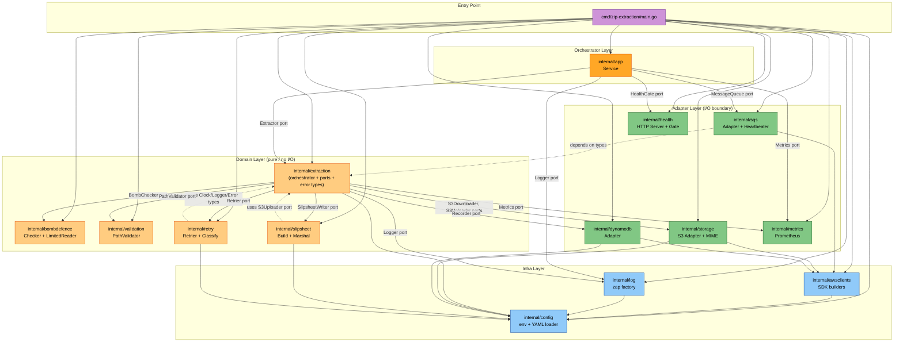
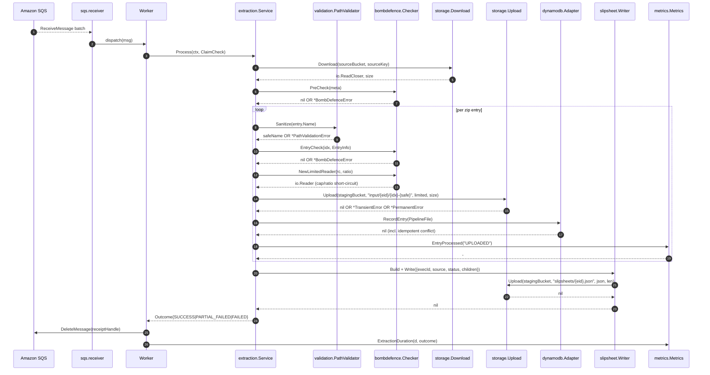

# Component Dependencies — Zip Extraction Service (UOW-SVC-12)

**Document Type**: Component Dependency Matrix + Data Flow
**Phase**: INCEPTION — Application Design (Part 2: Generation)
**Generated**: 2026-05-24

This document records dependencies between the components defined in `components.md`. Per Q1 (narrow consumer-defined interfaces), domain components depend on **interfaces**, not on adapter implementations directly. Concrete wiring happens once in `cmd/zip-extraction/main.go`.

---

## 1. Dependency Matrix

Rows depend on columns. `■` indicates a direct dependency. `i` indicates an interface dependency (the row component declares an interface that the column component implements). All dependencies flow **downward** (no cycles).

|                       | extraction | bombdefence | validation | storage | dynamodb | slipsheet | retry | sqs | metrics | health | config | awsclients | log |
|-----------------------|:--:|:--:|:--:|:--:|:--:|:--:|:--:|:--:|:--:|:--:|:--:|:--:|:--:|
| **cmd/zip-extraction**| ■  | ■  | ■  | ■  | ■  | ■  | ■  | ■  | ■  | ■  | ■  | ■  | ■  |
| **app**               | i  |    |    |    |    |    |    | i  | i  | i  | ■  |    | i  |
| **sqs**               | i (ClaimCheck) |  |  |  |  |  |    |    | i  |    |    |    | i  |
| **extraction**        |    | i  | i  | i  | i  | i  | i  |    | i  |    | ■ (Config types) |    | i  |
| **bombdefence**       |    |    |    |    |    |    |    |    |    |    |    |    |    |
| **validation**        |    |    |    |    |    |    |    |    |    |    |    |    |    |
| **storage**           |    |    |    |    |    |    |    |    |    |    | ■ (Config) |    |    |
| **dynamodb**          |    |    |    |    |    |    |    |    |    |    | ■ (Config) |    |    |
| **slipsheet**         | i (S3Uploader) |  |  |  |  |  |    |    |    |    | ■ (Config) |    |    |
| **retry**             | (uses extraction.Clock/Logger/TransientError types) | | | | | | | | | | ■ (Config) |  |    |
| **metrics**           |    |    |    |    |    |    |    |    |    |    |    |    |    |
| **health**            |    |    |    |    |    |    |    |    |    |    |    |    |    |
| **config**            |    |    |    |    |    |    |    |    |    |    |    |    |    |
| **awsclients**        |    |    |    |    |    |    |    |    |    |    | ■ (InfraConfig) |    |    |
| **log**               |    |    |    |    |    |    |    |    |    |    | ■ (LoggingConfig) |    |    |

### Key observations

1. **`cmd/zip-extraction` is the only universal importer.** It wires all components together. This satisfies SECURITY-11 (separation of concerns — security-critical components don't know about each other's existence).
2. **No cycles.** `extraction` depends on ports it defines itself; adapters in `storage` / `dynamodb` / `slipsheet` etc. depend on extraction's types but not vice-versa.
3. **`bombdefence` and `validation` are pure leaves.** They depend on nothing except stdlib + extraction's error types. This makes them maximally testable (PBT-friendly, no mocks needed) and satisfies SECURITY-11.
4. **`config` is a leaf.** Everything imports `config`'s typed shapes; `config` imports nothing project-internal. This makes startup-time validation a pure operation.
5. **Adapter packages depend only on `extraction`'s port interfaces and `config`.** They do NOT depend on each other — e.g., `storage` does not import `dynamodb`.

---

## 2. Layered Architecture View

---

## 3. Communication Patterns

| Pattern | Where used | Notes |
|---|---|---|
| **Synchronous in-process call** | All domain ↔ adapter calls within a worker goroutine | Standard Go function call through interface dispatch |
| **Goroutine + cancellation context** | SQS receiver, worker pool, heartbeats, HTTP server | One `context.Context` tree rooted in `app.Service.Run` |
| **Bounded semaphore (channel-based)** | Worker pool size = `cfg.MaxInFlight` | A buffered chan struct{} of capacity N — `receiver` writes a token before dispatch, worker reads on completion |
| **HTTP (in-pod only)** | Kubelet → `/healthz/{live,ready}`, Prometheus → `/metrics` | Localhost or ClusterIP; not internet-exposed |
| **AWS SDK (HTTPS)** | All AWS calls | TLS enforced by default; LocalStack endpoint override does NOT disable TLS verification in dev (`AWS_ENDPOINT_URL=http://localstack:4566` is the only legitimate non-HTTPS scheme and it is local-only) |

---

## 4. Data-Flow Diagram (Per-Message Happy Path)

---

## 5. Boundary Crossing: Local vs Production

All component-to-component edges within the pod use **the same Go function calls** in both environments. The **only edges that change behaviour** between environments are the four outbound AWS-SDK arrows (Download / Upload / RecordEntry / SQS ops):

| Env | Endpoint | TLS? | Auth |
|---|---|---|---|
| Production EKS | `<service>.eu-west-1.amazonaws.com` | TLS 1.2+ | IRSA (no static creds) |
| Local LocalStack | `http://localstack:4566` | None (LocalStack convention) | Dummy `AWS_ACCESS_KEY_ID=test` (LocalStack convention) |

Per the parity analysis in Section 5 of `services.md`, no code path branches on environment. This means the **dependency graph is identical** in both environments — the only difference is the runtime value injected into `awsclients.Build(ctx, cfg.Infra)`.

---

## 6. Compliance Cross-References

| Concern | Resolution |
|---|---|
| **SECURITY-11 separation of concerns** | Two pure security packages (`bombdefence`, `validation`) are leaf nodes; their callers depend on them via Extractor ports — they themselves depend on nothing project-internal |
| **SECURITY-15 fail-closed** | Every adapter returns typed errors (`*TransientError` / `*PermanentError`); `extraction.Service` never silently swallows; `cmd/zip-extraction` has a top-level recover that logs + exits non-zero |
| **PBT-07 generator quality** | Because domain components depend only on small interfaces, PBT generators inject fake adapters with deterministic behaviour — no Testcontainers needed for property tests |
| **PBT-10 complementary tests** | Adapter packages have Gate 2 (Testcontainers/LocalStack) integration tests; domain packages have unit + PBT tests with fakes. Test files are organised so the boundary is obvious |

---

## 7. Hand-off to Functional Design

Functional Design (CONSTRUCTION phase) will refine:

- The **port interface definitions** in `extraction/ports.go` with full Godoc including expected error types and goroutine-safety guarantees.
- The **error-classification table** (which AWS SDK error codes map to which typed error) — needed for `retry.Classify`.
- The **rapid-test generator definitions** for `ClaimCheck`, `PipelineFile`, `Slipsheet`, `ArchiveMetadata`, and `EntryInfo` — used across all PBT properties.
