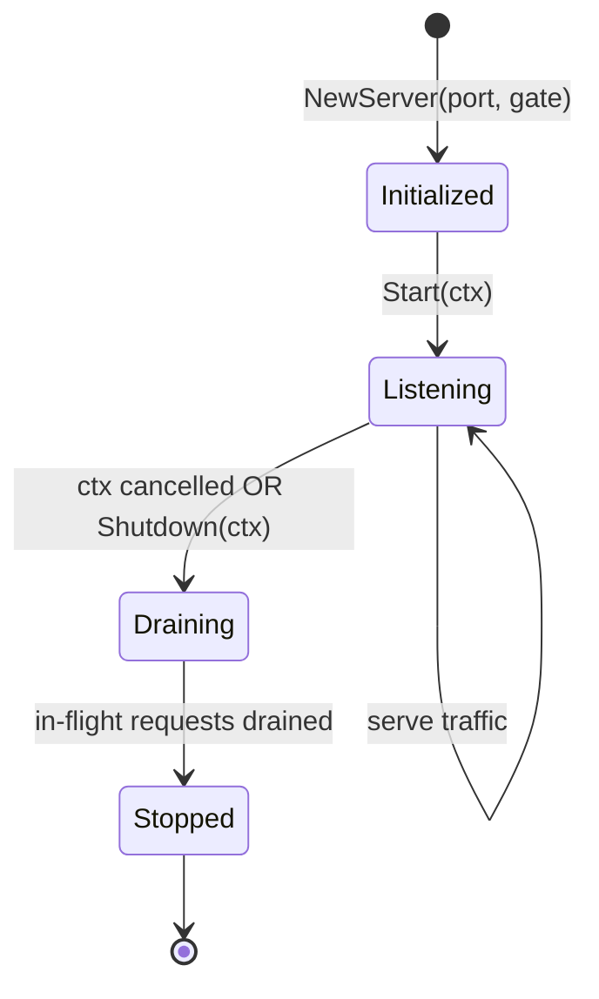
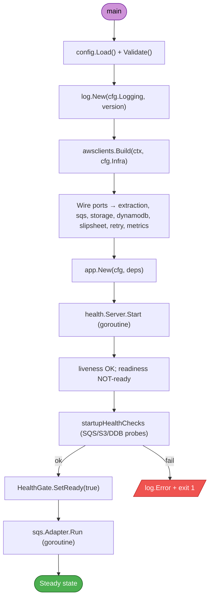
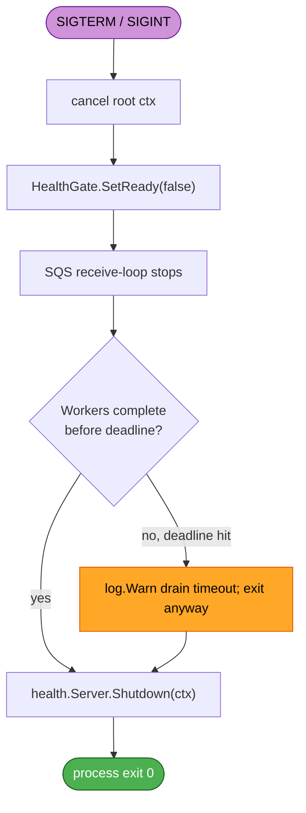

# Services — Zip Extraction Service (UOW-SVC-12)

**Document Type**: Service-Layer Definitions
**Phase**: INCEPTION — Application Design (Part 2: Generation)
**Generated**: 2026-05-24

This document defines the **service layer** — the long-running runtime constructs that orchestrate the components from `components.md`. There are three runtime services inside a single pod:

1. **App Service** (`internal/app.Service`) — top-level coordinator.
2. **SQS Consumer Service** (`internal/sqs.Adapter`) — long-poll receive-loop + worker pool.
3. **HTTP Operational Server** (`internal/health.Server`) — `/healthz/{live,ready}` + `/metrics`.

Per Q3 they share a **single HTTP port** (default 8080). Per Q2 there is **one SQS receiver goroutine + a bounded worker pool** sized by `sqs.maxInFlight`.

---

## 1. App Service

**Owner package**: `internal/app`
**Responsibility**: Compose the other two services, manage their lifecycles, coordinate graceful shutdown (Q7).

### Lifecycle

| Phase | Behaviour |
|---|---|
| Construction | `main` calls `app.New(cfg, deps)`. No I/O. |
| Startup | `Run(ctx)` performs sequential startup health checks (SQS / S3 / DynamoDB reachability). Liveness probe responds 200 from process start; readiness probe responds 200 only after all health checks pass — `HealthGate.SetReady(true)`. |
| Steady state | SQS receive-loop pulls messages and dispatches to workers; HTTP server serves probes and metrics; per-message heartbeat goroutines extend SQS visibility every 30 s. |
| Drain | On `ctx.Done()`: signal SQS receive-loop to stop pulling; mark readiness false (probe → 503) so Kubernetes stops sending traffic; wait up to `gracefulShutdownTimeoutSec` (default 250 s) for in-flight workers to complete; heartbeat goroutines continue extending visibility during drain. |
| Terminate | Shut down HTTP server (`server.Shutdown`); return from `Run` so `main` exits 0. |

### Public surface

```go
package app

type Service struct { /* unexported */ }

func New(cfg Config, deps Dependencies) *Service
func (s *Service) Run(ctx context.Context) error
```

---

## 2. SQS Consumer Service

**Owner package**: `internal/sqs`
**Responsibility**: Per Q2 — single long-poll receive-loop + bounded worker pool of size `cfg.MaxInFlight` (default 5). One message per worker. Per-message heartbeat goroutine extends visibility every 30 s per Q6 / FR-9.

### Sequence: normal message flow

```mermaid
sequenceDiagram
    autonumber
    participant K8s as Kubernetes
    participant App as app.Service
    participant Recv as sqs.receiver goroutine
    participant Pool as worker pool (size N)
    participant Heart as heartbeat goroutine
    participant Ext as extraction.Service
    participant SQS as Amazon SQS

    K8s->>App: Pod start
    App->>App: startupHealthChecks (SQS/S3/DDB reachable)
    App->>App: HealthGate.SetReady(true)
    App->>Recv: spawn

    loop until shutdown
        Recv->>SQS: ReceiveMessage(MaxNumberOfMessages=10, WaitTimeSeconds=20)
        SQS-->>Recv: batch (≤10 messages)
        loop per message in batch
            Recv->>Pool: dispatch(msg) [blocks if pool full]
            Pool->>Heart: Start(ctx, receiptHandle)
            Pool->>Ext: Process(ctx, parsedMsg)
            Note over Heart,SQS: every 30s: ChangeMessageVisibility(+300s)
            Ext-->>Pool: Outcome{Status, Reason}
            Pool->>Heart: cancel()
            alt Outcome.Status in {SUCCESS, PARTIAL_FAILED, FAILED}
                Pool->>SQS: DeleteMessage(receiptHandle)
            else fatal/transient panic
                Pool->>SQS: (leave; SQS native redrive after visibility expiry)
            end
        end
    end
```

### Sequence: graceful shutdown (Q7)

```mermaid
sequenceDiagram
    autonumber
    participant K8s as Kubernetes
    participant App as app.Service
    participant Recv as sqs.receiver
    participant Pool as worker pool
    participant Heart as heartbeats
    participant Ext as extraction.Service
    participant SQS as Amazon SQS

    K8s->>App: SIGTERM
    App->>App: cancel root ctx
    App->>App: HealthGate.SetReady(false) [503 on readiness]
    App->>Recv: stop signal
    Recv->>SQS: (no more ReceiveMessage)
    Note over Pool,Heart: in-flight workers continue;<br/>heartbeats keep extending visibility
    par drain timer
        App->>App: wait up to gracefulShutdownTimeoutSec (250s)
    and worker completion
        Ext-->>Pool: Outcome (each worker)
        Pool->>SQS: DeleteMessage per completed worker
    end
    alt all workers done before deadline
        App-->>K8s: process exits 0 (clean drain)
    else deadline hit
        App-->>K8s: process exits 0 (any remaining → SQS reclaim)
        Note over SQS: visibility timeout reclaims;<br/>idempotency (FR-5.3) prevents duplicate effect
    end
```

### Concurrency contract

- **Receive-loop goroutine**: exactly 1.
- **Worker goroutines**: `cfg.MaxInFlight` semaphore-bounded (default 5).
- **Heartbeat goroutines**: 1 per in-flight message, ≤ `cfg.MaxInFlight` at any moment.
- **Total goroutines under steady state**: `1 + N + N ≤ 11` for default `N=5`. Well within Go's runtime budget.

### Public surface

```go
package sqs

type MessageHandler func(ctx context.Context, msg extraction.ClaimCheck) (extraction.Outcome, error)

type Adapter struct { /* unexported */ }
func NewAdapter(client SQSClient, cfg Config, heart Heartbeater) *Adapter
func (a *Adapter) Run(ctx context.Context, handler MessageHandler) error
```

---

## 3. HTTP Operational Server

**Owner package**: `internal/health`
**Responsibility**: Per Q3 — single port, three routes.

### Routes

| Path | Method | Handler | Response |
|---|---|---|---|
| `/healthz/live` | GET | Liveness | 200 OK always once process running |
| `/healthz/ready` | GET | Readiness | 200 OK iff `HealthGate.Ready() == true`; otherwise 503 |
| `/metrics` | GET | `promhttp.Handler()` | Prometheus exposition format |

### Server lifecycle



### Public surface

```go
package health

type Server struct { /* unexported */ }
func NewServer(port int, gate HealthGate) *Server
func (s *Server) Start(ctx context.Context) error
func (s *Server) Shutdown(ctx context.Context) error

type HealthGate interface {
    SetReady(ready bool)
    Ready() bool
}
type Gate struct { /* unexported */ }
func NewGate() *Gate
```

---

## 4. Cross-Service Coordination

### Startup ordering (`app.Service.Run`)



### Shutdown ordering (`app.Service.gracefulDrain`)



**Why readiness is flipped to false during drain**:
Kubernetes routes traffic to a Pod only while its readiness probe returns 200. Setting `ready=false` early in the drain causes the Service endpoints controller to remove the pod from the load-balancer rotation immediately, even before the SQS message pull stops. (This matters less here because the only HTTP traffic is probes and the Prometheus scraper — but it is still correct discipline and matches Helm chart expectations.)

---

## 5. Local-Production Parity

Per Q1 of requirements verification and the parity discussion preceding the Application Design Q&A, every service above runs identically in LocalStack-based local dev and in EKS production. The only legitimate differences are:

| Differs by env? | What | Where it lives |
|---|---|---|
| Yes | `AWS_ENDPOINT_URL` (empty in prod, `http://localstack:4566` locally) | Env var (per Q8 of requirements) |
| Yes | `LOG_FORMAT` (`json` in prod, `console` locally) | Env var |
| Yes | YAML config values for tunable limits (`maxInFlight`, retry counts, bomb thresholds) | ConfigMap volume mount / local file |
| Yes | Container runtime (Docker Compose locally; EKS Deployment in prod) | Deployment artefacts |
| No | All code paths in `cmd/zip-extraction` and `internal/*` | Same binary |
| No | Goroutine topology, retry classifier, error hierarchy, drain sequence | Same code |

---

## 6. SECURITY / PBT Compliance Notes

| Rule | Where enforced in services |
|---|---|
| SECURITY-09 (hardening) | `health.Server` exposes only the three documented routes — no debug / pprof / sample endpoints |
| SECURITY-11 (separation) | `app.Service` is pure wiring; security-critical components remain isolated |
| SECURITY-14 (alerting) | Metrics emitted by all services are consumed by the platform-team Prometheus / alerting pipeline; chart README documents recommended alert rules |
| SECURITY-15 (fail-safe) | All long-running goroutines (receiver, workers, heartbeats, HTTP server) recover panics at their top frame and log via `Logger.Error` with the stack trace masked from any HTTP response; resources released via `defer` |
| PBT-06 (stateful) | The SQS service is the primary target of stateful PBT (heartbeat lifecycle + shutdown drain command sequences) |

---

## 7. Hand-off to Functional Design

The CONSTRUCTION-phase Functional Design will refine for the single unit UOW-SVC-12:

- The full state machine for `extraction.Service.Process` (per-entry success / fail / bomb / unsupported transitions).
- Concrete `rapid` test plans for every property listed in `component-methods.md` "Testable Properties" tables.
- Concrete error-classification table mapping every AWS SDK error code to `transient` vs `permanent`.
- Detailed shutdown timing analysis: under what worst-case scenario the 250 s drain deadline could be insufficient and the fallback behaviour.
