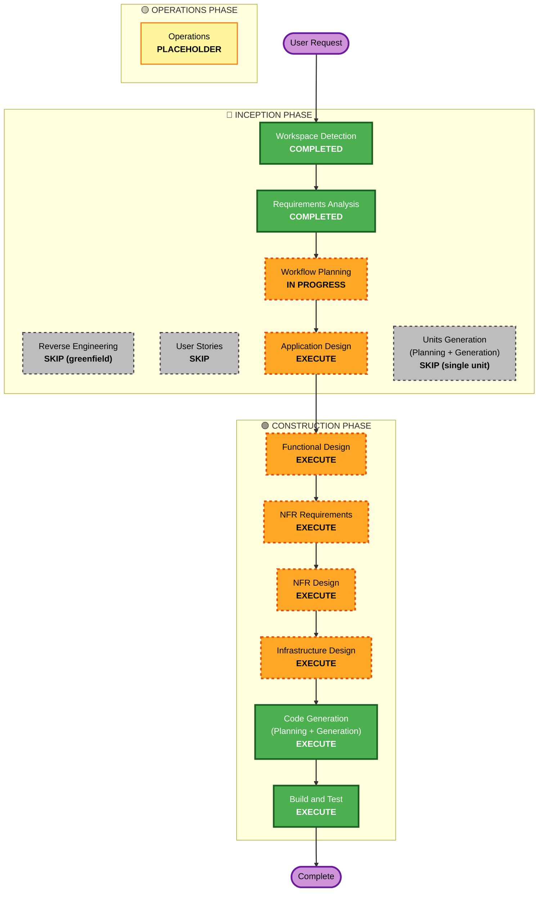

# Execution Plan — Zip Extraction Service (UOW-SVC-12)

**Document Type**: Execution Plan
**Project**: Zip Extraction Service (UOW-SVC-12)
**Phase**: INCEPTION — Workflow Planning
**Generated**: 2026-05-24
**Inputs Consumed**:
- `aidlc-docs/inception/requirements/requirements.md`
- `aidlc-docs/inception/requirements/requirement-verification-questions.md`
- `zip-extraction-service-input.md`

---

## 1. Detailed Analysis Summary

### 1.1 Transformation Scope
**Not applicable** — greenfield project. No existing system to transform.

### 1.2 Change Impact Assessment

| Impact Area | Affected? | Description |
|---|---|---|
| User-facing changes | No | Machine-to-machine service; the only "users" are upstream SQS producer (Document Uploader) and downstream pipeline services consuming S3 PutObject events |
| Structural changes | Yes | Net-new service introduced into the document ingestion pipeline architecture |
| Data model changes | Yes | New DynamoDB record schema (`pipeline_files.PK = PIPELINE#…, SK = FILE#…`), new slipsheet JSON schema, new SQS claim-check message contract |
| API changes | Yes | New SQS message contract (input); new operational HTTP endpoints (`/healthz/live`, `/healthz/ready`, `/metrics`) |
| NFR impact | Yes | Performance bounds (P95 < 180 s, memory ≤ 128 MiB), security (15 SECURITY rules), observability (zap + Prometheus), reliability (stateless, classifier-driven retry) |

#### Application Layer Impact
- **Code**: New Go module with ~10 internal packages (extraction, bombdefence, storage, dynamodb, slipsheet, metrics, validation, retry, config, awsclients) plus `cmd/zip-extraction/main.go`
- **Dependencies**: `aws-sdk-go-v2`, `go.uber.org/zap`, `github.com/prometheus/client_golang`, `github.com/testcontainers/testcontainers-go`, `pgregory.net/rapid`
- **Configuration**: Environment variables (infrastructure) + YAML file (tunable limits) per FR-14
- **Testing**: Unit tests + PBT (rapid) + Gate 2 Testcontainers/LocalStack E2E

#### Infrastructure Layer Impact
- **Deployment model**: Kubernetes Deployment on EKS (DEV05-EKS-CLUSTER, eu-west-1)
- **Container**: Multi-stage Dockerfile producing static binary; non-root UID; read-only root filesystem; pinned base image digest
- **Helm chart**: Minimal skeleton — Deployment, Service, ConfigMap, ServiceAccount, values.yaml
- **AWS resources required (operated by platform team, NOT provisioned by this repo)**: S3 staging bucket with SSE + non-TLS deny policy; SQS queue `zip-extraction-queue` + DLQ; DynamoDB `pipeline_files`; IRSA role with least-privilege policy

#### Operations Layer Impact
- **Monitoring**: Prometheus metrics on `/metrics` (6 metrics per FR-13.2); alert rules documented in chart README as platform-team integration points
- **Logging**: zap structured logs to stdout; JSON in prod / console in local (`LOG_FORMAT` env)
- **Alerting**: Recommended alerts (high `zip_bomb_rejections_total` rate, sustained `zip_extraction_failures_total` rate) documented for platform team
- **CI/CD**: Build pipeline integration (lint, unit + PBT, Gate 2 LocalStack E2E, vulnerability scan via `govulncheck`, SBOM via `syft`, Docker image build with pinned digest)

### 1.3 Component Relationship Mapping
**Not applicable** — greenfield single-component project. No existing component graph to map. Internal package dependencies will be defined during Application Design.

### 1.4 Risk Assessment

| Dimension | Level | Notes |
|---|---|---|
| Overall risk | **Medium** | Single isolated component (no cross-system coordination), but high security-criticality (untrusted ZIP input, bomb-defence, path-traversal surface) means design rigor matters |
| Rollback complexity | **Easy** | Stateless service; rollback = redeploy previous image tag; in-flight SQS messages reclaimed via visibility timeout |
| Testing complexity | **Moderate** | PBT enforcement on bomb-defence and path-validation invariants requires careful generator design; Gate 2 LocalStack E2E requires Testcontainers infrastructure |
| Security blast radius | **Bounded** | Service consumes ZIPs and writes only to a dedicated staging bucket prefix + a single DynamoDB table; IRSA scope confines AWS surface |
| Operational blast radius | **Bounded** | Failure mode is "ZIPs sit in DLQ"; no upstream blast (producer is decoupled via SQS) and no in-band downstream effect (fan-out via S3 events is naturally isolated per child) |

---

## 2. Workflow Visualization

---

## 3. Phases to Execute

### 🔵 INCEPTION PHASE

| Stage | Status | Rationale |
|---|---|---|
| Workspace Detection | ✅ **COMPLETED** | Workspace identified as greenfield; target directory `services/zip-extraction/` |
| Reverse Engineering | ⛔ **SKIP** | Greenfield project — no existing system to reverse-engineer |
| Requirements Analysis | ✅ **COMPLETED** | 16 FRs + 11 NFRs documented; 12 Q&A answers captured; SECURITY + PBT extensions opted in |
| User Stories | ⛔ **SKIP** | Single-component machine-to-machine microservice with no human-facing UI; upstream SQS producer and downstream S3-event consumers are fully specified by FR-1 and FR-4; no multiple personas requiring distinct journeys. The detailed input spec serves as the authoritative requirement source. User explicitly chose "Approve & Continue" (not "Add User Stories") at the requirements approval gate. |
| Workflow Planning | 🔄 **IN PROGRESS** | This document |
| Application Design | 🟠 **EXECUTE** | New service with ~10 internal packages whose method signatures, business rules, and dependency relationships need documentation. SECURITY-11 (separation of concerns) explicitly requires security-critical logic (bombdefence, validation) to be isolated in dedicated modules — this requires up-front design. Required artefacts: component diagram, package responsibilities, public interfaces, dependency graph. |
| Units Generation | ⛔ **SKIP** | Input spec already declares this as a single unit (UOW-SVC-12). No further decomposition needed; the Go internal-package layout is captured in NFR-11 and refined during Application Design. |

### 🟢 CONSTRUCTION PHASE (per-unit; single unit = UOW-SVC-12)

| Stage | Status | Rationale |
|---|---|---|
| Functional Design | 🟠 **EXECUTE** | Non-trivial business logic: 10-rule bomb-defence state machine evaluated incrementally during streaming, path-validation algorithm, SUCCESS/PARTIAL_FAILED/FAILED state transitions, classifier-driven retry policy, slipsheet serialization. New data models (DynamoDB record, slipsheet JSON, SQS message). PBT-01 mandates property identification during this stage. |
| NFR Requirements | 🟠 **EXECUTE** | Performance bounds (P95 latency, memory cap), security baseline (all 15 SECURITY rules), scalability concerns (max-in-flight, multipart upload), tech stack selection (Go 1.24, AWS SDK v2, zap, rapid, prometheus) all need formal capture. PBT-09 requires framework selection in this stage. |
| NFR Design | 🟠 **EXECUTE** | NFR Requirements is executing, so NFR Design follows naturally to translate NFRs into concrete patterns: structured-logging schema, metrics taxonomy, retry/backoff implementation, secrets handling (IRSA), TLS/HTTPS posture for AWS SDK calls. |
| Infrastructure Design | 🟠 **EXECUTE** | Helm chart design (5 templates), ConfigMap shape, ServiceAccount + IRSA annotation pattern, S3 bucket policy posture (deny non-TLS), SQS queue + DLQ redrive configuration, DynamoDB table key schema all need explicit design. |
| Code Generation | 🟢 **EXECUTE (always)** | Required by workflow definition; both Part 1 (Planning) and Part 2 (Generation) will run |
| Build and Test | 🟢 **EXECUTE (always)** | Required by workflow definition; generates Makefile targets, Dockerfile, CI integration documentation, Gate 1 unit-test instructions, Gate 2 LocalStack E2E instructions; Gate 3 deferred per Q11 |

### 🟡 OPERATIONS PHASE

| Stage | Status | Rationale |
|---|---|---|
| Operations | 🟨 **PLACEHOLDER** | Future expansion — deployment, monitoring, incident response runbooks not yet in scope |

---

## 4. Package Change Sequence
**Not applicable** — single-module greenfield project. The repository ships as one Go module under `services/zip-extraction/`.

---

## 5. Estimated Timeline

| Phase / Stage | Estimate |
|---|---|
| INCEPTION — Application Design | 1 working session |
| CONSTRUCTION — Functional Design | 1 working session |
| CONSTRUCTION — NFR Requirements | 1 working session |
| CONSTRUCTION — NFR Design | 1 working session |
| CONSTRUCTION — Infrastructure Design | 1 working session |
| CONSTRUCTION — Code Generation (Planning + Generation) | 2–3 working sessions (highest-effort stage; spans ~10 packages + tests + chart + Dockerfile + Makefile) |
| CONSTRUCTION — Build and Test | 1 working session |
| **Total** | **8–9 working sessions** |

Estimates assume continuous user availability for approval gates between stages.

---

## 6. Success Criteria

### Primary Goal
Deliver a production-ready, memory-bounded, security-hardened Go microservice that consumes ZIP-extraction jobs from SQS, performs streaming decompression with 10-point bomb-defence, uploads child entries to S3, persists per-entry DynamoDB records, generates parent slipsheets, and fans out via S3 PutObject events.

### Key Deliverables
1. Go application code under `services/zip-extraction/` (cmd + ~10 internal packages)
2. Multi-stage Dockerfile (non-root, read-only root FS, pinned base digest)
3. Makefile with targets: `build`, `test`, `lint`, `up`, `down`, `bootstrap`, `run`, `docker`, `pbt-replay`
4. Minimal Helm chart (Deployment, Service, ConfigMap, ServiceAccount, values.yaml)
5. `docker-compose.yml` (LocalStack + service) for local dev
6. Unit tests (Gate 1) + PBT (rapid) covering NFR-8 properties
7. Gate 2 Testcontainers/LocalStack E2E test suite
8. Build & test execution instructions

### Quality Gates
1. **Security**: All applicable SECURITY-01…15 rules compliant; no blocking findings (3 rules N/A per requirements.md NFR-6)
2. **PBT**: All PBT-01…10 rules compliant; framework `rapid` integrated; CI logs seed on every run
3. **Coverage**: Unit-test statement coverage ≥80 %
4. **Streaming invariants**: No `io.ReadAll` / `ioutil.ReadFile` on archive or entry streams (verified by lint rule or code review)
5. **Memory**: Service stays within 128 MiB pod limit under Gate 2 load tests with archives up to 500 MB compressed
6. **Build supply chain**: `go.sum` committed; `govulncheck` clean; SBOM generated via `syft`; Dockerfile base image pinned by digest
7. **Build & test passes**: `make build && make test && make e2e` completes successfully against LocalStack

---

## 7. Approval & Override Policy

The recommended EXECUTE/SKIP decisions reflect the model's intelligent assessment given the inputs. **The user retains full control** to override any decision:

- **Force-include any SKIPPED stage** — e.g., reinstate User Stories or Units Generation if you want their artefacts authored explicitly.
- **Force-skip any EXECUTE stage** — e.g., collapse Application Design into Functional Design if you prefer a tighter loop (not recommended given SECURITY-11).
- **Request changes** to scope estimates, risk assessment, or timeline.

Use the "WHAT'S NEXT?" options on the next message to direct the workflow.
