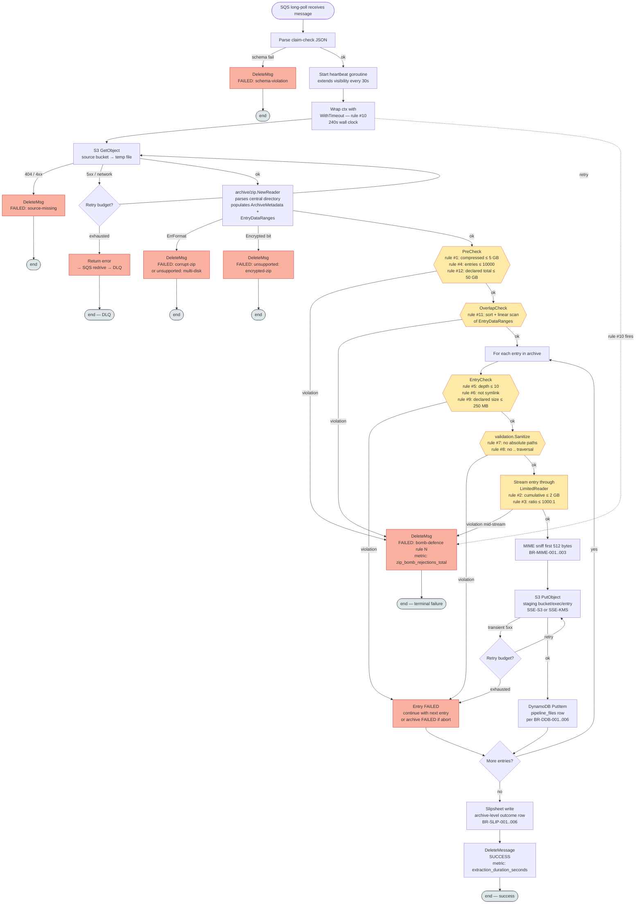

# Zip Extraction Service (UOW-SVC-12)

**Streaming ZIP decompression service** for the document-uploader pipeline. Consumes claim-check messages from SQS, downloads ZIP archives from S3, performs 12-point bomb-defence validation, fans out child entries to a staging S3 prefix, and writes a parent slipsheet for downstream consumers.

Generated end-to-end via the AI-DLC workflow — see `aidlc-docs/` at the workspace root for the full design trail.

## Quick Start (Local Development)

```bash
# 1. Bring up LocalStack + the service container
make up

# 2. Provision LocalStack (idempotent)
make bootstrap

# 3. Tail logs
docker compose -f deploy/docker-compose.yml logs -f zip-extraction

# Or run the service in-process against LocalStack:
make run
```

Send a test message:

```bash
aws --endpoint-url=http://localhost:4566 sqs send-message \
    --queue-url http://localhost:4566/000000000000/zip-extraction-queue \
    --message-body '{
        "pipelineExecutionId": "exec-test-1",
        "tenantId": "tenant-1",
        "documentId": "doc-1",
        "sourceBucket": "doc-uploader-uploads-local",
        "sourceKey": "uploads/sample.zip",
        "correlationId": "corr-1"
    }'
```

## Architecture

```
SQS (zip-extraction-queue)
        │
        ▼
┌─────────────────────────┐
│  Zip Extraction Service │   stateless Go 1.24, EKS pod
│   (this repo / chart)   │   • 12-rule bomb defence
└──┬──────────────────┬───┘   • streaming I/O only
   │                  │       • per-msg SQS heartbeat
   ▼                  ▼       • Q12 retry classifier
S3 staging      DynamoDB
input/*.json    pipeline_files
slipsheets/*.json
   │
   ▼
S3 PutObject events → downstream pipelines
```

See:
- `aidlc-docs/inception/application-design/application-design.md` — components, methods, services, dependencies
- `aidlc-docs/construction/zip-extraction/functional-design/` — state machine, business rules, domain entities
- `aidlc-docs/construction/zip-extraction/nfr-design/` — patterns + logical components
- `aidlc-docs/construction/zip-extraction/infrastructure-design/` — AWS mapping + deployment

## Message Lifecycle (Flow)

Per-message flow through the service, with all 12 bomb-defence rules called out at their actual decision points.



**Where the 12 bomb-defence rules fire**:

| Stage | Rules | Trust | Code |
|---|---|---|---|
| `PreCheck` (post-parse, pre-stream) | #1, #4, **#12** | trusted, trusted, untrusted | `internal/bombdefence/checker.go` |
| `OverlapCheck` (post-parse, pre-stream) | **#11** | trusted | `internal/bombdefence/checker.go` |
| `EntryCheck` (pre-stream, per entry) | #5, #6, #9 | trusted, trusted, untrusted | `internal/bombdefence/checker.go` |
| Path validation (per entry) | #7, #8 | trusted | `internal/validation` |
| `LimitedReader` (streaming) | #2, #3 | trusted | `internal/bombdefence/checker.go` |
| `ctx.WithTimeout` (orchestrator) | #10 | trusted | `internal/extraction/service.go` |

**Terminal outcomes**:
- **SUCCESS** → `DeleteMessage`, slipsheet written, `extraction_duration_seconds` recorded
- **Bomb-defence violation** → `DeleteMessage` (NEVER DLQ — redriving would just re-reject; see `BR-BOMB-008`)
- **Schema / corrupt / unsupported feature** → `DeleteMessage` (also deterministic)
- **Transient 5xx / throttle / timeout** → retried with backoff; after exhaustion → DLQ via SQS redrive policy
- **Pod shutdown mid-extraction** → visibility-timeout expires → SQS redelivers; extraction is idempotent (`BR-IDEMPOTENCY-001..006`)

## Environment Variables

| Var | Purpose | Example |
|---|---|---|
| `AWS_REGION` | AWS region | `eu-west-1` |
| `AWS_ENDPOINT_URL` | LocalStack override (empty in prod) | `http://localstack:4566` |
| `QUEUE_URL` | SQS queue URL | `https://sqs.eu-west-1.amazonaws.com/<acct>/zip-extraction-queue` |
| `STAGING_BUCKET` | S3 staging bucket name | `doc-uploader-staging-eu-west-1` |
| `DYNAMO_TABLE` | DynamoDB table | `pipeline_files` |
| `LOG_FORMAT` | `json` (prod) or `console` (local) | `json` |
| `LOG_LEVEL` | `info`, `debug`, `warn`, `error` | `info` |
| `HTTP_PORT` | Operational HTTP server port | `8080` |
| `SSE_MODE` | `SSE-S3` or `SSE-KMS` | `SSE-S3` |
| `SSE_KMS_KEY_ID` | KMS key ARN when SSE-KMS | `arn:aws:kms:...:key/...` |
| `CONFIG_PATH` | Path to tunable YAML config | `/etc/zip-extraction/config.yaml` |

## YAML Config Schema (Mounted ConfigMap)

```yaml
bombDefence:    { maxCompressedSizeBytes, maxExtractedSizeBytes, maxCompressionRatio,
                  maxEntryCount, maxDirectoryDepth, maxSingleFileSizeBytes,
                  maxExtractionDurationSec, maxTotalDeclaredUncompressedBytes }
streaming:      { maxInMemoryBufferBytes, multipartThresholdBytes }
retry:          { maxAttempts, backoffBaseMillis, backoffFactor, jitterFraction }
sqs:            { heartbeatIntervalSec, maxInFlight, gracefulShutdownTimeoutSec, visibilityTimeoutSec }
```

See `deploy/config-local.yaml` for the canonical default values.

## Observability

- `GET /healthz/live` — liveness; always 200 once running
- `GET /healthz/ready` — readiness; 200 iff AWS reachability passed AND not draining
- `GET /metrics` — Prometheus exposition

Eight emitted metrics (see `internal/metrics/metrics.go`):
- `zip_entries_total{status}` (counter)
- `zip_extraction_duration_seconds{outcome}` (histogram)
- `zip_extraction_failures_total{reason}` (counter)
- `zip_bomb_rejections_total{rule}` (counter)
- `extracted_bytes_total` (counter)
- `partial_failures_total` (counter)
- `redelivery_skips_total` (counter — idempotent redelivery indicator)
- `slipsheet_write_failures_total` (counter)

## Deployment

```bash
# Sandbox
helm upgrade --install zip-extraction ./chart \
    -f chart/values.yaml -f chart/values-sandbox.yaml

# Staging / Production: same pattern with the corresponding overlay.
```

See `chart/README.md` for the platform-team integration guide (HPA, NetworkPolicy, VPC endpoints, IRSA policy, alert rules).

### DEV05 ephemeral deploy (full bootstrap + revert)

A self-contained per-developer environment on the shared DEV05 EKS cluster, with every AWS resource DEV05-prefixed so teardown is safe. All resources are tracked in `deploy/dev05/state.json` and removed by `make undeploy-dev05`.

```bash
make deploy-dev05         # AWS bootstrap (SQS/S3/DDB/IAM) → push image → helm install → Route 53 record
make list-dev05           # what's deployed (state.json + live AWS/K8s checks)
make logs-dev05           # aggregated logs: deploy/undeploy files + K8s events + pod logs
make undeploy-dev05       # full revert: Route 53 → helm uninstall → namespace → AWS resources
```

Per-run logs land in `deploy/dev05/logs/{deploy,undeploy}-<UTC>.log` (gitignored). The end-to-end inventory + design contract is `deploy/dev05-resources.md`.

The DEV05 deploy also stands up the developer **test harness** behind an IP-allowlisted public ALB at `http://zip-extraction-dev-sandbox-v1.dev05.k8s.opus2dev.com/`. The harness reuses the service's IRSA role (same SQS/S3/DDB perms). See `test/harness/README.md` for the developer-tool details.

## Testing Gates

| Gate | Command | What it runs |
|---|---|---|
| Gate 1 (unit + PBT) | `make test` | All `_test.go` + `pgregory.net/rapid` properties |
| Gate 2 (LocalStack E2E) | `go test -tags=e2e ./test/e2e/...` | Testcontainers + LocalStack integration |
| Gate 3 (sandbox EKS E2E) | _Deferred_ per Q11 of requirements verification | — |

## Operational Tools

- **Heap dump on demand**: `kubectl exec <pod> -- kill -USR1 1` writes `/tmp/heap-<RFC3339>.pprof`. `kubectl cp` to retrieve. No HTTP pprof endpoint is exposed (SECURITY-09).
- **PBT failure replay**: failing CI run logs the seed; `make pbt-replay SEED=<n>` re-runs deterministically.

## Security Posture (summary)

- IRSA-only AWS authentication (no static credentials)
- Distroless non-root container, read-only root filesystem
- TLS 1.2+ enforced via AWS SDK defaults
- Sensitive-field log deny-list (passwords, tokens, credentials, AWS keys)
- 12-point streaming zip-bomb defence with mid-stream short-circuit (rules #1–#12)
- Path-traversal / absolute-path / symlink rejection
- Conditional DynamoDB writes + deterministic S3 keys → idempotent under SQS re-delivery
- Image + SBOM cosign-signed via Sigstore keyless OIDC

Full SECURITY-01…15 + PBT-01…10 compliance matrix in `aidlc-docs/`.

## License

See workspace root `LICENSE` (placeholder — populate during repository onboarding).
